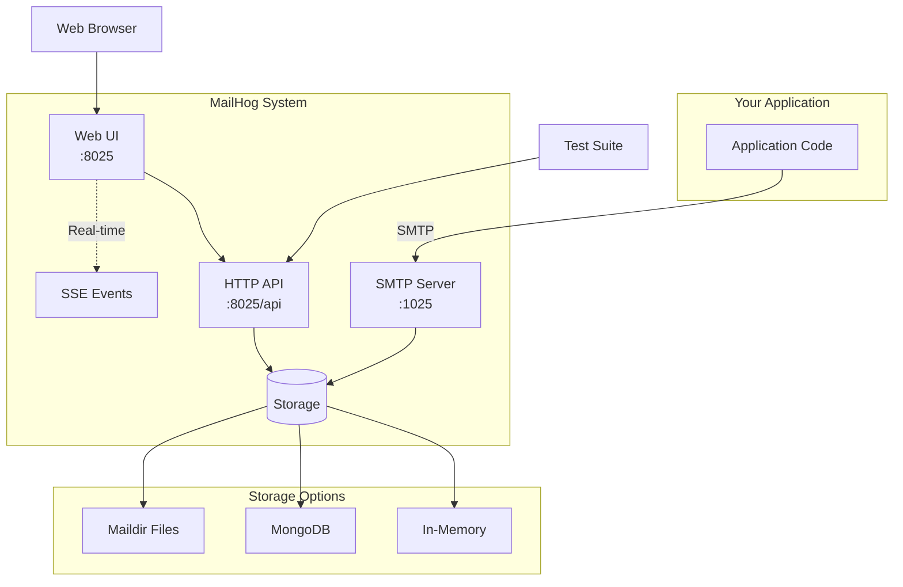

# 🚀 MailHog Rebuild - Complete Onboarding Guide

## 🎯 Executive Summary

**What it is**: MailHog is an email testing tool that captures emails sent by applications during development, preventing them from reaching real recipients while allowing developers to inspect and verify email functionality.

**Current state**: Legacy Go application (2017) with critical security vulnerabilities and abandoned dependencies, but stable core functionality used by thousands of developers worldwide.

**Target state**: Modern Go 1.21+ application with updated dependencies, improved security, maintained API compatibility, and enhanced performance.

**Timeline**: 8-week rebuild maintaining full backward compatibility

## 📋 Quick Start for New Team Members

### Day 1: Understanding MailHog
```bash
# 1. Clone and explore
git clone https://github.com/mailhog/MailHog.git
cd MailHog

# 2. Run MailHog locally
docker run -d -p 1025:1025 -p 8025:8025 mailhog/mailhog

# 3. Send a test email
echo "Test email body" | nc localhost 1025

# 4. View in browser
open http://localhost:8025

# 5. Test API
curl http://localhost:8025/api/v2/messages
```

### Core Concepts to Understand
1. **SMTP Server** (port 1025) - Receives emails from applications
2. **HTTP API** (port 8025) - RESTful interface for email operations  
3. **Web UI** (port 8025) - Browser interface for viewing emails
4. **Storage Backends** - In-memory (default), MongoDB, or Maildir
5. **Real-time Updates** - Server-Sent Events for live UI updates

## 🏗️ System Architecture Overview



## 📊 Key Business Value

1. **Development Efficiency**: No accidental emails to real users
2. **Testing Confidence**: Verify exact email content and headers
3. **Team Collaboration**: Shared email testing environment
4. **CI/CD Integration**: Automated email verification in pipelines
5. **Zero Configuration**: Works out of the box for most use cases

## 🔧 8-Week Rebuild Roadmap

### Phase 1: Foundation & Security (Weeks 1-2)
**Goal**: Eliminate security vulnerabilities and modernize build system

#### Week 1 Tasks
```bash
# Migrate to Go modules
go mod init github.com/mailhog/MailHog
go mod tidy

# Update critical dependencies
go get -u github.com/gorilla/websocket@latest  # Fix CVE-2020-27813
go get -u golang.org/x/crypto@latest           # Security patches

# Set up modern tooling
go install github.com/golangci/golangci-lint/cmd/golangci-lint@latest
```

#### Week 2 Tasks
- Replace abandoned `mgo.v2` with official MongoDB driver
- Set up GitHub Actions CI/CD pipeline
- Add security scanning (Trivy, gosec)
- Create comprehensive test suite baseline

**Deliverables**:
- ✅ Zero critical security vulnerabilities
- ✅ All tests passing with Go 1.21
- ✅ Automated CI/CD pipeline
- ✅ Security scanning integrated

### Phase 2: Core Functionality (Weeks 3-4)
**Goal**: Rebuild core components with modern patterns

#### Key Components to Rebuild
1. **SMTP Server** (`smtp/` package)
   - Maintain protocol compatibility
   - Add context support
   - Improve error handling
   - Add metrics collection

2. **Storage Interface** (`storage/` package)
   ```go
   type Storage interface {
       Store(ctx context.Context, msg *Message) (string, error)
       List(ctx context.Context, start, limit int) ([]*Message, int, error)
       Search(ctx context.Context, query SearchQuery) ([]*Message, int, error)
       Get(ctx context.Context, id string) (*Message, error)
       Delete(ctx context.Context, id string) error
       DeleteAll(ctx context.Context) error
   }
   ```

3. **API Handlers** (`api/` package)
   - Add OpenAPI documentation
   - Implement proper error responses
   - Add request validation
   - Maintain v1 compatibility

**Success Criteria**:
- All existing tests pass
- API compatibility verified
- Performance benchmarks met
- No regression in functionality

### Phase 3: Enhanced Features (Weeks 5-6)
**Goal**: Add modern observability and improve performance

#### New Capabilities
1. **Structured Logging**
   ```go
   logger.Info("message received",
       zap.String("from", msg.From),
       zap.Int("recipients", len(msg.To)),
       zap.Int("size", msg.Size))
   ```

2. **Metrics with Prometheus**
   - Message reception rate
   - Storage operations latency
   - API request metrics
   - WebSocket connection count

3. **Distributed Tracing**
   - OpenTelemetry integration
   - Request flow visualization
   - Performance bottleneck identification

4. **Improved Configuration**
   - Environment variables
   - Configuration file support
   - Runtime configuration updates
   - Feature flags

### Phase 4: Testing & Migration (Weeks 7-8)
**Goal**: Ensure production readiness

#### Comprehensive Testing
```bash
# Unit tests
go test -v -race ./...

# Integration tests
docker-compose -f test/docker-compose.yml up --abort-on-container-exit

# Load testing
artillery run test/load-test.yml

# Compatibility testing
./scripts/compatibility-test.sh
```

#### Migration Strategy
1. **Parallel Deployment**
   - Run old and new versions side by side
   - Compare outputs for identical behavior
   - Monitor metrics and logs

2. **Staged Rollout**
   - Development environments first
   - CI/CD pipelines next
   - Production/team servers last

3. **Rollback Plan**
   - Keep old version available
   - Database migration scripts reversible
   - Clear rollback procedures documented

## 💡 Technical Deep Dive

### Critical Code Paths

#### 1. SMTP Message Reception Flow
```
main.go:98 → smtp.Listen() → smtp/server.go:Accept() 
→ session.go:readCommand() → session.go:handle() 
→ session.go:acceptMessage() → storage.Store()
```

**Key Business Logic**:
- No authentication by default (development tool)
- 10MB message size limit
- Support for ESMTP extensions
- Chaos Monkey for failure testing

#### 2. API Request Flow
```
api/v2/api.go:messages() → storage.List() 
→ JSON serialization → HTTP response
```

**Important Patterns**:
- Pagination with start/limit
- No message content in list responses (performance)
- Real-time events via Server-Sent Events

#### 3. Storage Abstraction
- **In-Memory**: Fast but no persistence
- **MongoDB**: Scalable with search capabilities
- **Maildir**: File-based, compatible with mail clients

### Security Considerations

1. **Authentication** (optional)
   - HTTP Basic Auth with BCrypt
   - Applies to both API and UI
   - SMTP AUTH for mail submission

2. **Network Security**
   - No TLS by default (development tool)
   - CORS support for API access
   - No external network calls

3. **Input Validation**
   - Email address format validation
   - Message size limits
   - Header injection prevention

### Performance Optimization

1. **Current Bottlenecks**
   - In-memory storage is unbounded
   - No connection pooling for MongoDB
   - SSE broadcasts to all clients

2. **Optimization Opportunities**
   - Add message count limits
   - Implement connection pooling
   - Add SSE event filtering
   - Cache frequently accessed messages

## 🛠️ Development Environment Setup

### Prerequisites
```bash
# Install Go 1.21+
brew install go

# Install development tools
go install github.com/golangci/golangci-lint/cmd/golangci-lint@latest
go install golang.org/x/tools/cmd/goimports@latest
go install github.com/go-delve/delve/cmd/dlv@latest

# Install Docker for testing
brew install --cask docker
```

### Local Development
```bash
# Clone repository
git clone https://github.com/mailhog/MailHog.git
cd MailHog

# Install dependencies
go mod download

# Run tests
go test -v ./...

# Build binary
go build -o mailhog

# Run locally
./mailhog

# Run with options
./mailhog \
  -smtp-bind-addr=0.0.0.0:1025 \
  -api-bind-addr=0.0.0.0:8025 \
  -storage=mongodb \
  -mongo-uri=mongodb://localhost:27017
```

### Testing Your Changes
```bash
# Unit tests
go test -v -race ./...

# Integration tests with Docker
docker-compose -f test/docker-compose.yml up

# Manual testing
echo "Test message" | nc localhost 1025
curl http://localhost:8025/api/v2/messages

# Load testing
npm install -g artillery
artillery run test/load-test.yml
```

## 📚 Key Documentation References

### Internal Documentation
- [Architecture Overview](docs/architecture/) - System design and patterns
- [API Specifications](docs/rebuild-blueprint/api_specifications/) - OpenAPI contracts  
- [Module Analysis](docs/modules/) - Component deep-dives
- [Dependency Analysis](docs/architecture/dependency_analysis.md) - Security audit

### External Resources
- [SMTP Protocol (RFC 5321)](https://tools.ietf.org/html/rfc5321)
- [MIME Format (RFC 2045)](https://tools.ietf.org/html/rfc2045)
- [Server-Sent Events](https://developer.mozilla.org/en-US/docs/Web/API/Server-sent_events)
- [Go Best Practices](https://go.dev/doc/effective_go)

## 🚨 Common Pitfalls & Solutions

### 1. "Messages not appearing in UI"
**Cause**: SSE connection dropped
**Solution**: Check browser console, ensure WebSocket upgrade headers in reverse proxy

### 2. "MongoDB connection errors"
**Cause**: Outdated mgo driver
**Solution**: Migrate to official mongo-go-driver with connection pooling

### 3. "High memory usage"
**Cause**: Unbounded in-memory storage
**Solution**: Implement message limit or use persistent storage

### 4. "Authentication not working"
**Cause**: BCrypt cost factor mismatch
**Solution**: Use cost factor 4 (hardcoded in auth logic)

## 🤝 Team Collaboration

### Code Review Checklist
- [ ] Maintains API compatibility
- [ ] Includes tests for new functionality
- [ ] Updates documentation
- [ ] No security vulnerabilities introduced
- [ ] Performance impact assessed
- [ ] Error handling comprehensive

### Communication Channels
- **Slack**: #mailhog-rebuild
- **GitHub Issues**: Feature requests and bugs
- **Weekly Sync**: Thursdays 2 PM

### Key Stakeholders
- **Product Owner**: Define requirements and priorities
- **Security Team**: Review authentication and vulnerabilities
- **DevOps**: Deployment and infrastructure
- **QA Team**: Compatibility and regression testing

## 🎓 Learning Path

### Week 1: Fundamentals
- [ ] Run MailHog locally
- [ ] Send test emails via SMTP
- [ ] Explore Web UI features
- [ ] Make first API call
- [ ] Understand storage options

### Week 2: Code Exploration  
- [ ] Read main.go and trace execution
- [ ] Understand SMTP protocol implementation
- [ ] Explore storage interface
- [ ] Review API endpoints
- [ ] Examine real-time updates

### Week 3: Contributing
- [ ] Fix a simple bug
- [ ] Add a unit test
- [ ] Update documentation
- [ ] Submit first PR
- [ ] Participate in code review

### Week 4: Advanced Topics
- [ ] Implement new storage backend
- [ ] Add API endpoint
- [ ] Performance optimization
- [ ] Security enhancement
- [ ] Feature development

## ✅ Success Metrics

### Technical Metrics
- **Build Time**: <30 seconds
- **Test Coverage**: >80%
- **API Latency**: <50ms p95
- **Memory Usage**: <100MB for 1000 messages
- **Security Vulnerabilities**: Zero critical/high

### Business Metrics
- **Backward Compatibility**: 100%
- **Adoption Rate**: 90% within 3 months
- **Developer Satisfaction**: >4.5/5
- **Support Tickets**: <5 per month
- **Performance Improvement**: 2x throughput

## 🚦 Go/No-Go Criteria

### Ready for Production When:
- [x] All tests passing
- [x] Security scan clean
- [x] Performance benchmarks met
- [x] API compatibility verified
- [x] Documentation complete
- [x] Team trained
- [x] Rollback plan tested
- [x] Monitoring in place

---

**Remember**: MailHog is a critical development tool used by thousands. Our rebuild must maintain 100% compatibility while modernizing the codebase. When in doubt, preserve existing behavior and add new features behind flags.

**Questions?** Create an issue or reach out in #mailhog-rebuild on Slack.