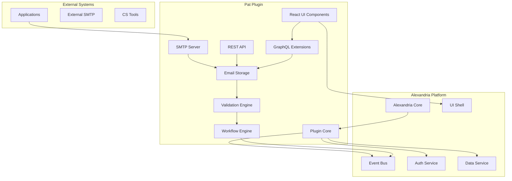

# Pat Alexandria Plugin - Solution Design & Development Plan

## Executive Summary

This document outlines the complete solution design and phased development plan to transform Pat from a standalone MailHog-based email testing tool into a fully integrated Alexandria platform plugin with enhanced customer service testing capabilities.

**Project Duration**: 16-20 weeks  
**Team Size**: 2-3 developers  
**Technology Stack**: Go, TypeScript, React, GraphQL, MongoDB/PostgreSQL

---

## Table of Contents

1. [Solution Architecture](#solution-architecture)
2. [Technical Design](#technical-design)
3. [Development Phases](#development-phases)
4. [Epic Breakdown](#epic-breakdown)
5. [Risk Mitigation](#risk-mitigation)
6. [Success Metrics](#success-metrics)

---

## Solution Architecture

### High-Level Architecture



### Component Design

#### 1. Plugin Core
- Implements Alexandria PluginLifecycle interface
- Manages plugin initialization and cleanup
- Handles configuration and permissions
- Coordinates between all plugin components

#### 2. SMTP Server
- Maintains MailHog protocol compatibility
- Adds enhanced parsing for CS-specific headers
- Implements rate limiting and spam detection
- Supports TLS and authentication

#### 3. Email Storage
- Pluggable storage backends (Memory, MongoDB, PostgreSQL)
- Implements retention policies
- Provides full-text search capabilities
- Handles attachment storage

#### 4. Validation Engine
- Template compliance checking
- Content validation rules
- Link and attachment verification
- Tone and sentiment analysis

#### 5. Workflow Engine
- Multi-step email sequence testing
- Conditional routing logic
- Response time tracking
- Escalation path validation

#### 6. API Layer
- RESTful API for backwards compatibility
- GraphQL extensions for Alexandria integration
- WebSocket support for real-time updates
- Batch operations support

#### 7. UI Components
- Modern React-based dashboard
- Email viewer with rich formatting
- Workflow designer
- Analytics and reporting views

---

## Technical Design

### Data Models

```typescript
// Core Email Model
interface Email {
  id: string;
  messageId: string;
  from: EmailAddress;
  to: EmailAddress[];
  cc?: EmailAddress[];
  bcc?: EmailAddress[];
  subject: string;
  headers: Map<string, string>;
  body: {
    text?: string;
    html?: string;
  };
  attachments: Attachment[];
  metadata: {
    receivedAt: Date;
    size: number;
    spamScore?: number;
    validationResults?: ValidationResult[];
  };
}

// CS Workflow Model
interface CSWorkflow {
  id: string;
  name: string;
  description: string;
  steps: WorkflowStep[];
  triggers: WorkflowTrigger[];
  validations: ValidationRule[];
  metrics: WorkflowMetrics;
}

// Template Model
interface EmailTemplate {
  id: string;
  name: string;
  category: string;
  subject: string;
  bodyTemplate: string;
  variables: TemplateVariable[];
  validationRules: ValidationRule[];
}
```

### API Design

#### GraphQL Schema Extensions
```graphql
extend type Query {
  # Email queries
  emails(filter: EmailFilter, pagination: PaginationInput): EmailConnection!
  email(id: ID!): Email
  
  # Template queries
  emailTemplates(category: String): [EmailTemplate!]!
  emailTemplate(id: ID!): EmailTemplate
  
  # Workflow queries
  csWorkflows(status: WorkflowStatus): [CSWorkflow!]!
  csWorkflow(id: ID!): CSWorkflow
  
  # Analytics queries
  emailAnalytics(timeRange: TimeRangeInput): EmailAnalytics!
}

extend type Mutation {
  # Email operations
  deleteEmail(id: ID!): Boolean!
  deleteEmails(ids: [ID!]!): BatchResult!
  releaseEmail(id: ID!, config: ReleaseConfig!): ReleaseResult!
  
  # Template operations
  createEmailTemplate(input: EmailTemplateInput!): EmailTemplate!
  updateEmailTemplate(id: ID!, input: EmailTemplateInput!): EmailTemplate!
  testEmailTemplate(id: ID!, data: JSON!): TestResult!
  
  # Workflow operations
  createCSWorkflow(input: CSWorkflowInput!): CSWorkflow!
  updateCSWorkflow(id: ID!, input: CSWorkflowInput!): CSWorkflow!
  executeCSWorkflow(id: ID!, context: JSON!): WorkflowExecution!
}

extend type Subscription {
  emailReceived(filter: EmailFilter): Email!
  workflowStatusChanged(workflowId: ID!): WorkflowStatus!
}
```

### Security Design

1. **Permission Model**
   - `pat:emails:read` - View captured emails
   - `pat:emails:delete` - Delete emails
   - `pat:emails:release` - Release emails to real SMTP
   - `pat:templates:manage` - Create/edit templates
   - `pat:workflows:manage` - Create/edit workflows
   - `pat:settings:manage` - Configure plugin settings

2. **Data Isolation**
   - Tenant-based data separation
   - Row-level security for multi-user environments
   - Encrypted storage for sensitive data

3. **Network Security**
   - TLS support for SMTP connections
   - API rate limiting
   - IP whitelisting options

---

## Development Phases

### Phase 1: Foundation (Weeks 1-4)
- Core plugin structure
- Basic SMTP server
- Memory storage
- Minimal UI

### Phase 2: Core Features (Weeks 5-8)
- Persistent storage
- Email viewer
- Basic API
- Search functionality

### Phase 3: CS Features (Weeks 9-12)
- Validation engine
- Template system
- Workflow basics
- Analytics

### Phase 4: Integration (Weeks 13-16)
- Full Alexandria integration
- Advanced workflows
- Reporting
- Performance optimization

### Phase 5: Polish & Launch (Weeks 17-20)
- UI/UX refinement
- Documentation
- Testing & QA
- Deployment

---

## Epic Breakdown

### EPIC 1: Plugin Foundation & Architecture
**Goal**: Establish the core plugin structure and basic functionality  
**Duration**: 4 weeks

#### TASK 1.1: Plugin Scaffold Setup
- **SUBTASK 1.1.1**: Create plugin directory structure
  - Set up TypeScript/React frontend structure
  - Initialize Go module for backend
  - Configure build tools and scripts
  
- **SUBTASK 1.1.2**: Implement plugin manifest
  - Define plugin.json with permissions
  - Set up version management
  - Configure service declarations

- **SUBTASK 1.1.3**: Create plugin lifecycle implementation
  - Implement PluginLifecycle interface
  - Set up activation/deactivation handlers
  - Add error handling and logging

#### TASK 1.2: Basic SMTP Server
- **SUBTASK 1.2.1**: Port MailHog SMTP core
  - Extract essential SMTP handling code
  - Remove vendor dependencies, use go.mod
  - Implement basic email reception

- **SUBTASK 1.2.2**: Integrate with Alexandria event system
  - Emit email received events
  - Handle configuration from plugin settings
  - Implement graceful shutdown

- **SUBTASK 1.2.3**: Add SMTP authentication
  - Support PLAIN and LOGIN mechanisms
  - Integrate with Alexandria auth service
  - Add connection security options

#### TASK 1.3: Memory Storage Implementation
- **SUBTASK 1.3.1**: Create storage interface
  - Define storage abstraction layer
  - Implement memory storage backend
  - Add basic CRUD operations

- **SUBTASK 1.3.2**: Implement email indexing
  - Add in-memory search capabilities
  - Create email metadata structure
  - Implement retention policies

#### TASK 1.4: Minimal UI Setup
- **SUBTASK 1.4.1**: Create React component structure
  - Set up component hierarchy
  - Implement Alexandria UI integration
  - Create basic routing

- **SUBTASK 1.4.2**: Build email list view
  - Create email list component
  - Add basic filtering
  - Implement pagination

- **SUBTASK 1.4.3**: Build email detail view
  - Create email viewer component
  - Add header display
  - Implement body rendering

---

### EPIC 2: Core Email Features
**Goal**: Implement essential email testing functionality  
**Duration**: 4 weeks

#### TASK 2.1: Persistent Storage
- **SUBTASK 2.1.1**: MongoDB storage backend
  - Implement MongoDB storage adapter
  - Add connection pooling
  - Create indexes for performance

- **SUBTASK 2.1.2**: PostgreSQL storage backend
  - Implement PostgreSQL adapter
  - Design relational schema
  - Add migration system

- **SUBTASK 2.1.3**: Storage backend selection
  - Implement storage factory
  - Add configuration UI
  - Create data migration tools

#### TASK 2.2: Enhanced Email Viewer
- **SUBTASK 2.2.1**: Rich HTML rendering
  - Implement safe HTML sanitization
  - Add CSS isolation
  - Support responsive preview

- **SUBTASK 2.2.2**: Attachment handling
  - Implement attachment storage
  - Add attachment preview
  - Support download functionality

- **SUBTASK 2.2.3**: Source view
  - Add raw email source viewer
  - Implement syntax highlighting
  - Add MIME part navigation

#### TASK 2.3: API Implementation
- **SUBTASK 2.3.1**: REST API endpoints
  - Implement email CRUD operations
  - Add search endpoints
  - Create batch operations

- **SUBTASK 2.3.2**: GraphQL schema extensions
  - Define GraphQL types
  - Implement resolvers
  - Add subscriptions

- **SUBTASK 2.3.3**: API authentication
  - Integrate with Alexandria auth
  - Implement permission checks
  - Add rate limiting

#### TASK 2.4: Search & Filter
- **SUBTASK 2.4.1**: Full-text search
  - Implement search indexing
  - Add search query parser
  - Support advanced operators

- **SUBTASK 2.4.2**: Advanced filtering
  - Create filter builder UI
  - Implement filter persistence
  - Add quick filters

- **SUBTASK 2.4.3**: Saved searches
  - Implement search saving
  - Add search sharing
  - Create search alerts

---

### EPIC 3: Customer Service Features
**Goal**: Add CS-specific testing and validation capabilities  
**Duration**: 4 weeks

#### TASK 3.1: Validation Engine
- **SUBTASK 3.1.1**: Validation rule system
  - Design rule architecture
  - Implement rule parser
  - Create rule builder UI

- **SUBTASK 3.1.2**: Content validators
  - Add regex validators
  - Implement schema validation
  - Create custom validators

- **SUBTASK 3.1.3**: Template compliance
  - Build template matcher
  - Add compliance reporting
  - Create validation history

#### TASK 3.2: Template System
- **SUBTASK 3.2.1**: Template management
  - Create template CRUD operations
  - Implement template versioning
  - Add template categories

- **SUBTASK 3.2.2**: Template editor
  - Build template editor UI
  - Add variable management
  - Implement preview functionality

- **SUBTASK 3.2.3**: Template testing
  - Create test data generator
  - Implement template execution
  - Add test result analysis

#### TASK 3.3: Basic Workflows
- **SUBTASK 3.3.1**: Workflow model
  - Design workflow data structure
  - Implement workflow storage
  - Create workflow API

- **SUBTASK 3.3.2**: Workflow designer
  - Build visual workflow editor
  - Implement drag-and-drop
  - Add step configuration

- **SUBTASK 3.3.3**: Workflow execution
  - Create workflow runtime
  - Implement step execution
  - Add execution logging

#### TASK 3.4: Analytics Foundation
- **SUBTASK 3.4.1**: Metrics collection
  - Define metric types
  - Implement collectors
  - Create aggregation system

- **SUBTASK 3.4.2**: Basic dashboards
  - Build dashboard framework
  - Create default dashboards
  - Add chart components

- **SUBTASK 3.4.3**: Report generation
  - Implement report templates
  - Add export functionality
  - Create scheduling system

---

### EPIC 4: Advanced Integration
**Goal**: Deep integration with Alexandria platform  
**Duration**: 4 weeks

#### TASK 4.1: Advanced Workflows
- **SUBTASK 4.1.1**: Conditional logic
  - Implement condition evaluator
  - Add branching support
  - Create condition builder UI

- **SUBTASK 4.1.2**: External integrations
  - Add webhook support
  - Implement API calls
  - Create integration library

- **SUBTASK 4.1.3**: Workflow orchestration
  - Build workflow scheduler
  - Add parallel execution
  - Implement error handling

#### TASK 4.2: Alexandria Integration
- **SUBTASK 4.2.1**: Knowledge base integration
  - Link emails to KB articles
  - Add auto-categorization
  - Create suggestion system

- **SUBTASK 4.2.2**: Ticket system integration
  - Connect to ticket creation
  - Add email-to-ticket mapping
  - Implement status sync

- **SUBTASK 4.2.3**: AI/ML integration
  - Add sentiment analysis
  - Implement auto-tagging
  - Create anomaly detection

#### TASK 4.3: Advanced Analytics
- **SUBTASK 4.3.1**: Custom metrics
  - Build metric designer
  - Add calculation engine
  - Create metric API

- **SUBTASK 4.3.2**: Advanced visualizations
  - Add complex chart types
  - Implement drill-down
  - Create interactive reports

- **SUBTASK 4.3.3**: Predictive analytics
  - Implement trend analysis
  - Add forecasting
  - Create alerts system

#### TASK 4.4: Performance Optimization
- **SUBTASK 4.4.1**: Database optimization
  - Add query optimization
  - Implement caching layer
  - Create index management

- **SUBTASK 4.4.2**: SMTP performance
  - Add connection pooling
  - Implement rate limiting
  - Optimize parsing

- **SUBTASK 4.4.3**: UI performance
  - Implement lazy loading
  - Add virtual scrolling
  - Optimize bundle size

---

### EPIC 5: Polish & Production Ready
**Goal**: Finalize for production deployment  
**Duration**: 4 weeks

#### TASK 5.1: UI/UX Refinement
- **SUBTASK 5.1.1**: Design system alignment
  - Apply Alexandria design tokens
  - Ensure consistency
  - Add dark mode support

- **SUBTASK 5.1.2**: Accessibility
  - Implement ARIA labels
  - Add keyboard navigation
  - Ensure WCAG compliance

- **SUBTASK 5.1.3**: Mobile responsiveness
  - Optimize for tablets
  - Add touch interactions
  - Create mobile layouts

#### TASK 5.2: Documentation
- **SUBTASK 5.2.1**: User documentation
  - Create user guides
  - Add video tutorials
  - Build help system

- **SUBTASK 5.2.2**: Developer documentation
  - Write API documentation
  - Create integration guides
  - Add code examples

- **SUBTASK 5.2.3**: Administrator guide
  - Document configuration
  - Add troubleshooting
  - Create deployment guide

#### TASK 5.3: Testing & QA
- **SUBTASK 5.3.1**: Unit testing
  - Achieve 80% coverage
  - Add test automation
  - Create test utilities

- **SUBTASK 5.3.2**: Integration testing
  - Test Alexandria integration
  - Verify API contracts
  - Test error scenarios

- **SUBTASK 5.3.3**: Performance testing
  - Load test SMTP server
  - Benchmark API endpoints
  - Profile UI performance

#### TASK 5.4: Deployment & Migration
- **SUBTASK 5.4.1**: Migration tools
  - Create MailHog migrator
  - Build data validators
  - Add rollback support

- **SUBTASK 5.4.2**: Deployment automation
  - Create CI/CD pipeline
  - Add health checks
  - Implement monitoring

- **SUBTASK 5.4.3**: Launch preparation
  - Create launch checklist
  - Prepare announcements
  - Plan rollout strategy

---

## Risk Mitigation

### Technical Risks

1. **SMTP Protocol Complexity**
   - Mitigation: Reuse proven MailHog implementation
   - Fallback: Limit initial protocol support

2. **Performance at Scale**
   - Mitigation: Design for horizontal scaling
   - Fallback: Implement aggressive retention

3. **Storage Requirements**
   - Mitigation: Implement efficient compression
   - Fallback: Cloud storage integration

### Integration Risks

1. **Alexandria API Changes**
   - Mitigation: Version lock dependencies
   - Fallback: Maintain compatibility layer

2. **Permission Model Conflicts**
   - Mitigation: Early collaboration with platform team
   - Fallback: Simplified permission model

### Business Risks

1. **User Adoption**
   - Mitigation: Maintain MailHog compatibility
   - Fallback: Standalone mode support

2. **Resource Constraints**
   - Mitigation: Phased delivery approach
   - Fallback: Reduce initial scope

---

## Success Metrics

### Technical Metrics
- SMTP processing: >1000 emails/minute
- API response time: <100ms (p95)
- UI load time: <2 seconds
- Plugin activation: <5 seconds
- Memory usage: <500MB baseline

### Business Metrics
- User adoption: 50% of Alexandria users within 6 months
- Feature usage: 80% use validation features
- Support tickets: <5% related to Pat
- Customer satisfaction: >4.5/5 rating

### Quality Metrics
- Test coverage: >80%
- Bug density: <5 bugs/KLOC
- Documentation coverage: 100% of public APIs
- Accessibility: WCAG 2.1 AA compliant

---

## Conclusion

This solution design provides a comprehensive roadmap for transforming Pat into a powerful Alexandria plugin while maintaining its core email testing capabilities. The phased approach ensures continuous delivery of value while managing technical complexity and risk.

The development plan balances feature development with technical excellence, ensuring Pat becomes a cornerstone tool for customer service teams using the Alexandria platform.