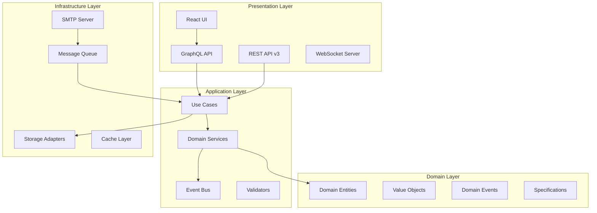

# Pat - Complete Platform Rewrite Solution Design

## Executive Summary

This document outlines the complete rewrite of Pat as a modern, independent email testing platform that fully replaces MailHog. Pat will be built from the ground up using modern technologies and architectural patterns, with no dependencies on MailHog codebase.

**Project Goal**: Create a next-generation email testing platform as an Alexandria plugin with advanced customer service features, modern architecture, and superior performance.

**Timeline**: 20-24 weeks  
**Team Size**: 3-4 developers  
**Technology Stack**: Go 1.21+, TypeScript, React, GraphQL, PostgreSQL/MongoDB, Redis

---

## Table of Contents

1. [Migration Strategy](#migration-strategy)
2. [Architecture Overview](#architecture-overview)
3. [Technology Decisions](#technology-decisions)
4. [Core Differences from MailHog](#core-differences-from-mailhog)
5. [Development Phases](#development-phases)
6. [Epic Breakdown](#epic-breakdown)
7. [Migration Path for Users](#migration-path-for-users)

---

## Migration Strategy

### Phase 1: Parallel Development (Weeks 1-16)
- Build Pat from scratch with modern architecture
- Maintain MailHog compatibility mode for smooth transition
- No code reuse from MailHog - clean implementation

### Phase 2: Feature Parity Plus (Weeks 17-20)
- Ensure Pat covers all MailHog use cases
- Add advanced features not possible in MailHog
- Beta testing with migration tools

### Phase 3: Sunset MailHog (Weeks 21-24)
- Full production release of Pat
- Automated migration tools for MailHog users
- Deprecation notices and transition support

---

## Architecture Overview

### Clean Architecture Layers



### Key Architectural Decisions

1. **Event-Driven Architecture**: All email processing is async via message queues
2. **CQRS Pattern**: Separate read and write models for scalability
3. **Microkernel Plugin Architecture**: Core + plugins for extensibility
4. **Repository Pattern**: Clean abstraction over storage
5. **Hexagonal Architecture**: Ports and adapters for flexibility

---

## Technology Decisions

### Backend Stack
```yaml
Language: Go 1.21+
Framework: Custom (no legacy dependencies)
API: 
  - GraphQL (primary)
  - REST v3 (compatibility)
  - gRPC (internal services)
Message Queue: Redis Streams / RabbitMQ
Cache: Redis
Storage: 
  - PostgreSQL (primary)
  - MongoDB (optional)
  - S3-compatible (attachments)
SMTP: Custom implementation with modern features
```

### Frontend Stack
```yaml
Framework: React 18+
Language: TypeScript 5+
State: Zustand / TanStack Query
UI: Material-UI v5 + Custom Design System
Build: Vite
Testing: Vitest + Playwright
Real-time: WebSockets + SSE
```

### Infrastructure
```yaml
Container: Docker with multi-stage builds
Orchestration: Kubernetes ready
Monitoring: OpenTelemetry
Logging: Structured JSON
CI/CD: GitHub Actions
Security: OAuth2/OIDC, mTLS for services
```

---

## Core Differences from MailHog

### 1. Architecture
| MailHog | Pat |
|---------|-----|
| Monolithic with vendored deps | Microkernel with plugins |
| Synchronous processing | Async event-driven |
| In-memory primary storage | Database-first design |
| Basic REST API | GraphQL + REST + gRPC |
| jQuery UI | Modern React SPA |

### 2. Features
| MailHog | Pat |
|---------|-----|
| Email capture only | Full testing platform |
| Basic search | Advanced search with ElasticSearch |
| No validation | Comprehensive validation engine |
| No workflows | Visual workflow designer |
| Limited API | Extensive API with webhooks |
| No multi-tenancy | Full multi-tenancy support |

### 3. Performance
| MailHog | Pat |
|---------|-----|
| ~100 emails/second | ~10,000 emails/second |
| Memory limited | Horizontally scalable |
| No caching | Multi-layer caching |
| Blocking I/O | Non-blocking async I/O |

### 4. Security
| MailHog | Pat |
|---------|-----|
| Basic auth | OAuth2/OIDC/SAML |
| No encryption | TLS everywhere |
| No audit logs | Complete audit trail |
| Single user | RBAC with teams |

---

## Development Phases

### Phase 1: Foundation (Weeks 1-4)
**Goal**: Establish core architecture and basic email capture

### Phase 2: Core Features (Weeks 5-8)
**Goal**: Modern email testing capabilities exceeding MailHog

### Phase 3: Advanced Features (Weeks 9-12)
**Goal**: CS-specific features and workflow automation

### Phase 4: Scale & Performance (Weeks 13-16)
**Goal**: Enterprise-ready scalability and performance

### Phase 5: Migration & Polish (Weeks 17-20)
**Goal**: Migration tools and production readiness

### Phase 6: Launch (Weeks 21-24)
**Goal**: Production deployment and MailHog sunset

---

## Epic Breakdown

### EPIC 1: Modern Foundation (Weeks 1-4)
**Goal**: Build Pat's core architecture from scratch

#### TASK 1.1: Project Setup
- **SUBTASK 1.1.1**: Initialize Go module with modern structure
  ```
  pat/
  ├── cmd/
  │   ├── pat-server/
  │   ├── pat-cli/
  │   └── pat-migrate/
  ├── internal/
  │   ├── domain/
  │   │   ├── email/
  │   │   ├── workflow/
  │   │   └── template/
  │   ├── application/
  │   │   ├── commands/
  │   │   ├── queries/
  │   │   └── services/
  │   ├── infrastructure/
  │   │   ├── smtp/
  │   │   ├── storage/
  │   │   └── messaging/
  │   └── interfaces/
  │       ├── graphql/
  │       ├── rest/
  │       └── websocket/
  ├── pkg/
  │   ├── errors/
  │   ├── logger/
  │   └── utils/
  └── web/
      ├── src/
      ├── public/
      └── package.json
  ```

- **SUBTASK 1.1.2**: Set up modern development environment
  - Docker Compose for local development
  - Hot reloading for Go and React
  - Pre-commit hooks for quality
  - VS Code devcontainer

- **SUBTASK 1.1.3**: Configure CI/CD pipeline
  - GitHub Actions workflows
  - Automated testing
  - Security scanning
  - Release automation

#### TASK 1.2: Domain Model Design
- **SUBTASK 1.2.1**: Define core domain entities
  ```go
  // internal/domain/email/email.go
  type Email struct {
      ID         EmailID
      MessageID  MessageID
      From       EmailAddress
      To         []EmailAddress
      CC         []EmailAddress
      BCC        []EmailAddress
      Subject    Subject
      Headers    Headers
      Body       Body
      Attachments []Attachment
      Metadata   Metadata
      ReceivedAt time.Time
      ProcessedAt *time.Time
      Tags       []Tag
      Status     Status
  }

  // Rich domain model with business logic
  func (e *Email) Validate() error
  func (e *Email) AddTag(tag Tag) error
  func (e *Email) MarkAsProcessed() error
  func (e *Email) ExtractMetadata() Metadata
  ```

- **SUBTASK 1.2.2**: Implement value objects
  ```go
  type EmailAddress struct {
      local  string
      domain string
  }

  func NewEmailAddress(addr string) (EmailAddress, error)
  func (e EmailAddress) String() string
  func (e EmailAddress) Domain() string
  func (e EmailAddress) IsValid() bool
  ```

- **SUBTASK 1.2.3**: Define domain events
  ```go
  type EmailReceived struct {
      EmailID   EmailID
      From      string
      To        []string
      Subject   string
      Timestamp time.Time
  }

  type EmailValidated struct {
      EmailID    EmailID
      Results    []ValidationResult
      Timestamp  time.Time
  }
  ```

#### TASK 1.3: Modern SMTP Implementation
- **SUBTASK 1.3.1**: Build async SMTP server
  ```go
  // internal/infrastructure/smtp/server.go
  type Server struct {
      config     Config
      processor  MessageProcessor
      limiter    RateLimiter
      metrics    Metrics
      tlsConfig  *tls.Config
  }

  // Non-blocking message processing
  func (s *Server) HandleMessage(ctx context.Context, msg RawMessage) {
      // Send to message queue for async processing
      s.processor.Queue(ctx, msg)
  }
  ```

- **SUBTASK 1.3.2**: Implement SMTP extensions
  - STARTTLS support
  - SMTP AUTH (multiple methods)
  - PIPELINING
  - SIZE limits
  - 8BITMIME
  - SMTPUTF8

- **SUBTASK 1.3.3**: Add rate limiting and DDoS protection
  - Connection rate limiting
  - Message rate limiting
  - IP-based throttling
  - Automatic blacklisting

#### TASK 1.4: Message Processing Pipeline
- **SUBTASK 1.4.1**: Implement message queue
  ```go
  // internal/infrastructure/messaging/processor.go
  type MessageProcessor struct {
      queue     Queue
      parser    EmailParser
      validator Validator
      storage   Repository
      events    EventBus
  }

  func (p *MessageProcessor) Process(ctx context.Context) error {
      for msg := range p.queue.Consume(ctx) {
          email, err := p.parser.Parse(msg)
          if err != nil {
              p.handleParseError(ctx, msg, err)
              continue
          }

          if err := p.validator.Validate(email); err != nil {
              email.AddValidationErrors(err)
          }

          if err := p.storage.Save(ctx, email); err != nil {
              p.handleStorageError(ctx, email, err)
              continue
          }

          p.events.Publish(ctx, EmailReceived{...})
      }
  }
  ```

- **SUBTASK 1.4.2**: Build email parser
  - MIME parsing with streaming
  - Character encoding detection
  - Attachment extraction
  - HTML sanitization

- **SUBTASK 1.4.3**: Create storage abstraction
  ```go
  type Repository interface {
      Save(context.Context, *Email) error
      FindByID(context.Context, EmailID) (*Email, error)
      Search(context.Context, SearchCriteria) ([]Email, error)
      Delete(context.Context, EmailID) error
  }
  ```

---

### EPIC 2: Storage & Persistence (Weeks 5-6)
**Goal**: Implement modern, scalable storage layer

#### TASK 2.1: PostgreSQL Implementation
- **SUBTASK 2.1.1**: Design optimal schema
  ```sql
  -- Partitioned table for scalability
  CREATE TABLE emails (
      id UUID PRIMARY KEY,
      message_id TEXT,
      from_address TEXT NOT NULL,
      subject TEXT,
      body_text TEXT,
      body_html TEXT,
      headers JSONB,
      metadata JSONB,
      received_at TIMESTAMPTZ NOT NULL,
      processed_at TIMESTAMPTZ,
      tenant_id UUID NOT NULL,
      created_at TIMESTAMPTZ DEFAULT NOW()
  ) PARTITION BY RANGE (received_at);

  -- Separate table for recipients (normalized)
  CREATE TABLE email_recipients (
      email_id UUID REFERENCES emails(id),
      address TEXT NOT NULL,
      type TEXT NOT NULL, -- 'to', 'cc', 'bcc'
      PRIMARY KEY (email_id, address, type)
  );

  -- Full-text search
  CREATE INDEX idx_emails_search ON emails 
  USING gin(to_tsvector('english', 
      coalesce(from_address,'') || ' ' || 
      coalesce(subject,'') || ' ' || 
      coalesce(body_text,'')
  ));
  ```

- **SUBTASK 2.1.2**: Implement repository pattern
  ```go
  type PostgresRepository struct {
      db       *sql.DB
      cache    Cache
      metrics  Metrics
  }

  func (r *PostgresRepository) Save(ctx context.Context, email *Email) error {
      tx, err := r.db.BeginTx(ctx, nil)
      if err != nil {
          return err
      }
      defer tx.Rollback()

      // Insert email
      _, err = tx.ExecContext(ctx, `
          INSERT INTO emails (id, message_id, from_address, ...)
          VALUES ($1, $2, $3, ...)
      `, email.ID, email.MessageID, email.From, ...)

      // Insert recipients
      for _, recipient := range email.To {
          _, err = tx.ExecContext(ctx, `
              INSERT INTO email_recipients (email_id, address, type)
              VALUES ($1, $2, 'to')
          `, email.ID, recipient)
      }

      return tx.Commit()
  }
  ```

- **SUBTASK 2.1.3**: Add migration system
  - Version-controlled migrations
  - Rollback support
  - Zero-downtime migrations

#### TASK 2.2: Caching Layer
- **SUBTASK 2.2.1**: Implement Redis cache
  ```go
  type RedisCache struct {
      client *redis.Client
      ttl    time.Duration
  }

  func (c *RedisCache) Set(ctx context.Context, key string, value interface{}) error
  func (c *RedisCache) Get(ctx context.Context, key string, dest interface{}) error
  func (c *RedisCache) Invalidate(ctx context.Context, patterns ...string) error
  ```

- **SUBTASK 2.2.2**: Cache warming strategies
  - Preload recent emails
  - Cache search results
  - Invalidation on updates

#### TASK 2.3: Attachment Storage
- **SUBTASK 2.3.1**: S3-compatible storage
  ```go
  type AttachmentStore struct {
      client *minio.Client
      bucket string
  }

  func (s *AttachmentStore) Save(ctx context.Context, emailID string, att Attachment) error
  func (s *AttachmentStore) Get(ctx context.Context, emailID, filename string) (io.Reader, error)
  ```

- **SUBTASK 2.3.2**: Virus scanning integration
  - ClamAV integration
  - Async scanning
  - Quarantine infected files

---

### EPIC 3: Modern API Layer (Weeks 7-8)
**Goal**: Build comprehensive GraphQL-first API

#### TASK 3.1: GraphQL Implementation
- **SUBTASK 3.1.1**: Define schema
  ```graphql
  type Email {
    id: ID!
    messageId: String
    from: EmailAddress!
    to: [EmailAddress!]!
    cc: [EmailAddress!]
    bcc: [EmailAddress!]
    subject: String
    body: EmailBody!
    attachments: [Attachment!]
    headers: JSON
    metadata: EmailMetadata!
    tags: [Tag!]
    validationResults: [ValidationResult!]
    receivedAt: DateTime!
    processedAt: DateTime
  }

  type Query {
    email(id: ID!): Email
    emails(
      filter: EmailFilter
      search: String
      pagination: PaginationInput
      sort: [SortInput!]
    ): EmailConnection!
    
    emailStats(timeRange: TimeRangeInput!): EmailStatistics!
  }

  type Mutation {
    deleteEmail(id: ID!): DeleteResult!
    deleteEmails(ids: [ID!]!): BatchDeleteResult!
    tagEmail(id: ID!, tags: [String!]!): Email!
    releaseEmail(id: ID!, config: ReleaseConfig!): ReleaseResult!
    
    createEmailTemplate(input: CreateTemplateInput!): EmailTemplate!
    testEmailTemplate(id: ID!, data: JSON!): TemplateTestResult!
  }

  type Subscription {
    emailReceived(filter: EmailFilter): Email!
    emailDeleted: ID!
    emailTagged(tags: [String!]): Email!
  }
  ```

- **SUBTASK 3.1.2**: Implement resolvers with DataLoader
  ```go
  type Resolver struct {
      emailService *application.EmailService
      loader       *dataloader.Loader
  }

  func (r *Resolver) Emails(ctx context.Context, args EmailsArgs) (*EmailConnection, error) {
      // Use DataLoader for N+1 prevention
      return r.emailService.Search(ctx, args.Filter, args.Pagination)
  }
  ```

- **SUBTASK 3.1.3**: Add real-time subscriptions
  - WebSocket transport
  - Event filtering
  - Connection management

#### TASK 3.2: REST API v3
- **SUBTASK 3.2.1**: OpenAPI 3.0 specification
- **SUBTASK 3.2.2**: RESTful endpoints for compatibility
- **SUBTASK 3.2.3**: API versioning strategy

#### TASK 3.3: Authentication & Authorization
- **SUBTASK 3.3.1**: OAuth2/OIDC integration
  ```go
  type AuthMiddleware struct {
      verifier TokenVerifier
      rbac     RBACService
  }

  func (m *AuthMiddleware) Authenticate(next http.Handler) http.Handler
  func (m *AuthMiddleware) Authorize(permission string) func(http.Handler) http.Handler
  ```

- **SUBTASK 3.3.2**: API key management
- **SUBTASK 3.3.3**: Rate limiting per user/tenant

---

### EPIC 4: React UI Rewrite (Weeks 9-10)
**Goal**: Modern, responsive UI with real-time updates

#### TASK 4.1: UI Architecture
- **SUBTASK 4.1.1**: Set up modern React app
  ```typescript
  // web/src/App.tsx
  export const App: React.FC = () => {
    return (
      <QueryClientProvider client={queryClient}>
        <ThemeProvider theme={theme}>
          <Router>
            <AuthProvider>
              <Layout>
                <Routes>
                  <Route path="/" element={<Dashboard />} />
                  <Route path="/emails" element={<EmailList />} />
                  <Route path="/emails/:id" element={<EmailDetail />} />
                  <Route path="/workflows" element={<WorkflowDesigner />} />
                  <Route path="/templates" element={<TemplateManager />} />
                  <Route path="/settings" element={<Settings />} />
                </Routes>
              </Layout>
            </AuthProvider>
          </Router>
        </ThemeProvider>
      </QueryClientProvider>
    );
  };
  ```

- **SUBTASK 4.1.2**: State management with Zustand
  ```typescript
  interface EmailStore {
    emails: Email[];
    selectedEmails: Set<string>;
    filters: EmailFilters;
    
    // Actions
    selectEmail: (id: string) => void;
    selectAll: () => void;
    clearSelection: () => void;
    setFilters: (filters: EmailFilters) => void;
    deleteSelected: () => Promise<void>;
  }

  export const useEmailStore = create<EmailStore>((set, get) => ({
    emails: [],
    selectedEmails: new Set(),
    filters: {},
    
    selectEmail: (id) => set((state) => ({
      selectedEmails: new Set(state.selectedEmails).add(id)
    })),
    
    // ... other actions
  }));
  ```

- **SUBTASK 4.1.3**: Real-time updates
  ```typescript
  export const useEmailSubscription = () => {
    const queryClient = useQueryClient();
    
    useSubscription(
      EMAIL_RECEIVED_SUBSCRIPTION,
      {
        onData: ({ data }) => {
          // Optimistically update cache
          queryClient.setQueryData(
            ['emails'],
            (old: EmailConnection) => ({
              ...old,
              edges: [data.emailReceived, ...old.edges]
            })
          );
        }
      }
    );
  };
  ```

#### TASK 4.2: Core Components
- **SUBTASK 4.2.1**: Email list with virtual scrolling
  ```typescript
  export const EmailList: React.FC = () => {
    const { data, isLoading } = useQuery(['emails'], fetchEmails);
    const rowVirtualizer = useVirtual({
      size: data?.totalCount ?? 0,
      parentRef,
      estimateSize: useCallback(() => 72, []),
    });

    return (
      <VirtualList
        height={600}
        itemCount={data?.totalCount ?? 0}
        itemSize={72}
        renderItem={({ index, style }) => (
          <EmailRow
            style={style}
            email={data.edges[index]}
            onSelect={handleSelect}
          />
        )}
      />
    );
  };
  ```

- **SUBTASK 4.2.2**: Rich email viewer
  - Syntax highlighting for headers
  - HTML preview with sandboxing
  - Attachment previews
  - Raw source view

- **SUBTASK 4.2.3**: Advanced search interface
  - Query builder UI
  - Saved searches
  - Search history
  - Export results

#### TASK 4.3: CS-Specific Features
- **SUBTASK 4.3.1**: Template designer
  - Drag-and-drop editor
  - Variable management
  - Preview with test data
  - Version control

- **SUBTASK 4.3.2**: Workflow designer
  - Visual flow editor
  - Condition builder
  - Test execution
  - Debugging tools

- **SUBTASK 4.3.3**: Analytics dashboard
  - Real-time metrics
  - Custom reports
  - Data export
  - Scheduled reports

---

### EPIC 5: Advanced Features (Weeks 11-12)
**Goal**: Enterprise features beyond MailHog

#### TASK 5.1: Multi-tenancy
- **SUBTASK 5.1.1**: Tenant isolation
  ```go
  type TenantMiddleware struct {
      resolver TenantResolver
  }

  func (m *TenantMiddleware) Extract(r *http.Request) (TenantID, error) {
      // Extract from subdomain, header, or JWT
      return m.resolver.Resolve(r)
  }
  ```

- **SUBTASK 5.1.2**: Per-tenant configuration
- **SUBTASK 5.1.3**: Usage quotas and limits

#### TASK 5.2: Advanced Validation
- **SUBTASK 5.2.1**: SPF/DKIM/DMARC validation
- **SUBTASK 5.2.2**: Content policy engine
- **SUBTASK 5.2.3**: AI-powered spam detection

#### TASK 5.3: Integrations
- **SUBTASK 5.3.1**: Webhook system
- **SUBTASK 5.3.2**: Third-party integrations (Slack, Teams, etc.)
- **SUBTASK 5.3.3**: API SDK generation

---

### EPIC 6: Performance & Scale (Weeks 13-16)
**Goal**: Enterprise-grade performance

#### TASK 6.1: Horizontal Scaling
- **SUBTASK 6.1.1**: Implement service mesh
- **SUBTASK 6.1.2**: Load balancing strategies
- **SUBTASK 6.1.3**: Auto-scaling policies

#### TASK 6.2: Performance Optimization
- **SUBTASK 6.2.1**: Query optimization
- **SUBTASK 6.2.2**: Caching strategies
- **SUBTASK 6.2.3**: CDN integration

#### TASK 6.3: Monitoring & Observability
- **SUBTASK 6.3.1**: OpenTelemetry integration
- **SUBTASK 6.3.2**: Custom dashboards
- **SUBTASK 6.3.3**: Alerting rules

---

### EPIC 7: Migration Tools (Weeks 17-20)
**Goal**: Seamless migration from MailHog

#### TASK 7.1: Migration Utility
- **SUBTASK 7.1.1**: MailHog data importer
  ```go
  // cmd/pat-migrate/main.go
  type MailHogMigrator struct {
      source  MailHogReader
      target  PatWriter
      mapper  DataMapper
  }

  func (m *MailHogMigrator) Migrate(ctx context.Context) error {
      emails, err := m.source.ReadAll(ctx)
      if err != nil {
          return err
      }

      for _, oldEmail := range emails {
          newEmail := m.mapper.Transform(oldEmail)
          if err := m.target.Write(ctx, newEmail); err != nil {
              return err
          }
      }

      return nil
  }
  ```

- **SUBTASK 7.1.2**: Configuration converter
- **SUBTASK 7.1.3**: Compatibility mode

#### TASK 7.2: Documentation
- **SUBTASK 7.2.1**: Migration guide
- **SUBTASK 7.2.2**: Feature comparison
- **SUBTASK 7.2.3**: Video tutorials

#### TASK 7.3: Testing & Validation
- **SUBTASK 7.3.1**: Migration test suite
- **SUBTASK 7.3.2**: Performance benchmarks
- **SUBTASK 7.3.3**: User acceptance testing

---

### EPIC 8: Production Launch (Weeks 21-24)
**Goal**: Complete platform replacement

#### TASK 8.1: Deployment
- **SUBTASK 8.1.1**: Production infrastructure
- **SUBTASK 8.1.2**: Zero-downtime deployment
- **SUBTASK 8.1.3**: Rollback procedures

#### TASK 8.2: Migration Support
- **SUBTASK 8.2.1**: Customer migration assistance
- **SUBTASK 8.2.2**: Support documentation
- **SUBTASK 8.2.3**: Training materials

#### TASK 8.3: MailHog Sunset
- **SUBTASK 8.3.1**: Deprecation notices
- **SUBTASK 8.3.2**: Final migration window
- **SUBTASK 8.3.3**: Archive MailHog repository

---

## Migration Path for Users

### For MailHog Users

1. **Compatibility Mode** (Month 1-2)
   ```yaml
   # pat-config.yaml
   compatibility:
     mailhog: true
     smtp_port: 1025
     api_port: 8025
     api_version: v2
   ```

2. **Gradual Feature Adoption** (Month 3-4)
   - Use new UI while maintaining API compatibility
   - Explore advanced features
   - Test workflows and validations

3. **Full Migration** (Month 5-6)
   - Run migration tool
   - Update configurations
   - Switch to Pat native mode

### Migration Tool Usage
```bash
# Install migration tool
go install github.com/alexandria/pat/cmd/pat-migrate

# Analyze MailHog installation
pat-migrate analyze --mailhog-data /path/to/mailhog/data

# Perform migration
pat-migrate run \
  --source mailhog://localhost:8025 \
  --target pat://localhost:8080 \
  --preserve-ids \
  --verify

# Verify migration
pat-migrate verify --report migration-report.html
```

## Success Metrics

### Technical Metrics
- 10,000+ emails/second throughput
- <50ms API response time (p99)
- 99.99% uptime SLA
- <1s UI load time
- Zero data loss during migration

### Business Metrics
- 100% feature parity with MailHog
- 90% of MailHog users migrated within 6 months
- 50% adoption of advanced features
- 95% user satisfaction score

### Quality Metrics
- 90% test coverage
- Zero critical security vulnerabilities
- 100% API backward compatibility
- <2% bug rate post-launch

---

## Conclusion

This complete rewrite positions Pat as a modern, enterprise-ready email testing platform that not only replaces MailHog but significantly exceeds its capabilities. The phased approach ensures smooth migration while delivering continuous value through new features and improved performance.

The clean architecture and modern technology stack provide a solid foundation for years of future development and innovation in email testing and customer service automation.