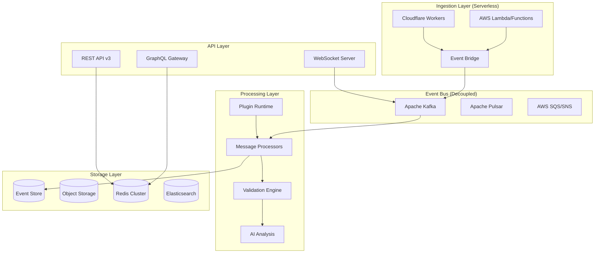

# Pat Email Testing Platform - Enhanced Solution Design v2

## Executive Summary

Based on comprehensive review feedback, this enhanced design incorporates serverless architecture, plugin extensibility, advanced testing features, and enterprise-grade security while maintaining the core innovation of multi-protocol email ingestion.

**Version**: 2.0  
**Date**: January 2024  
**Status**: Enhanced Design incorporating review feedback

---

## Table of Contents

1. [Enhanced Architecture](#enhanced-architecture)
2. [Technology Stack](#technology-stack)
3. [Plugin & Extensibility Framework](#plugin--extensibility-framework)
4. [Advanced Testing Features](#advanced-testing-features)
5. [Security & Compliance](#security--compliance)
6. [Observability & Analytics](#observability--analytics)
7. [Risk Mitigation](#risk-mitigation)
8. [Consolidated Roadmap](#consolidated-roadmap)

---

## Enhanced Architecture

### Serverless-First Design



### Key Architectural Improvements

1. **Serverless Ingestion**
   ```yaml
   Benefits:
   - Auto-scaling from 0 to millions
   - Cost-effective at all volumes
   - No infrastructure management
   - Global edge deployment
   ```

2. **Event-Driven Decoupling**
   ```yaml
   Message Flow:
   - Ingestion → Event Bus → Processing
   - Each stage independently scalable
   - Easy to add new processors
   - Built-in retry and DLQ
   ```

3. **Multi-Region Active-Active**
   ```yaml
   Regions:
   - US-East: Primary
   - EU-West: Active replica
   - AP-South: Active replica
   
   Features:
   - Global load balancing
   - Automatic failover
   - Data replication via Kafka
   - <50ms latency worldwide
   ```

---

## Technology Stack

### Core Technologies

| Layer | Technology | Rationale |
|-------|------------|-----------|
| **Language** | Go 1.21+, TypeScript 5+ | Performance + Developer experience |
| **Ingestion** | AWS Lambda, Cloudflare Workers | Serverless scale |
| **Event Bus** | Apache Kafka | Proven scale, ecosystem |
| **API** | GraphQL (Apollo), REST | Modern + compatibility |
| **Storage** | PostgreSQL (primary), S3 (objects) | Reliability + cost |
| **Cache** | Redis Cluster | Performance |
| **Search** | Elasticsearch | Full-text capabilities |
| **Container** | Docker, Kubernetes | Standard deployment |
| **Monitoring** | Prometheus, Grafana | Observability |
| **Security** | HashiCorp Vault | Secrets management |

### Development Stack

```yaml
Frontend:
  - React 18+
  - TypeScript
  - Material-UI v5
  - Vite
  - TanStack Query
  - Zustand

Testing:
  - Vitest (unit)
  - Playwright (E2E)
  - k6 (load testing)

CI/CD:
  - GitHub Actions
  - ArgoCD
  - Terraform
```

---

## Plugin & Extensibility Framework

### Plugin Architecture

```typescript
// Plugin SDK Interface
export interface PatPlugin {
  metadata: PluginMetadata;
  
  // Lifecycle hooks
  onInstall?(context: PluginContext): Promise<void>;
  onActivate?(context: PluginContext): Promise<void>;
  onDeactivate?(): Promise<void>;
  
  // Email processing hooks
  onEmailReceived?(email: Email): Promise<EmailModification | null>;
  onEmailValidated?(email: Email, results: ValidationResult[]): Promise<void>;
  onEmailStored?(email: Email): Promise<void>;
  
  // Custom endpoints
  routes?: RouteDefinition[];
  graphqlExtensions?: GraphQLExtension[];
  
  // UI contributions
  uiComponents?: UIComponentDefinition[];
}
```

### Plugin Runtime

```javascript
// Embedded V8 isolate for safe execution
class PluginRuntime {
  private isolates: Map<string, ivm.Isolate> = new Map();
  
  async loadPlugin(plugin: Plugin): Promise<void> {
    const isolate = new ivm.Isolate({ memoryLimit: 128 });
    const context = await isolate.createContext();
    
    // Inject safe APIs
    await context.global.set('pat', this.createPluginAPI(plugin));
    
    // Load plugin code
    const script = await isolate.compileScript(plugin.code);
    await script.run(context);
    
    this.isolates.set(plugin.id, isolate);
  }
  
  createPluginAPI(plugin: Plugin): PluginAPI {
    return {
      logger: this.createSafeLogger(plugin),
      storage: this.createSandboxedStorage(plugin),
      http: this.createLimitedHTTP(plugin),
      email: {
        modify: (changes) => this.applyEmailChanges(changes),
        validate: (rules) => this.runValidation(rules),
      }
    };
  }
}
```

### Plugin Examples

```javascript
// Spam Score Plugin
export default {
  metadata: {
    id: 'spam-scorer',
    name: 'Spam Score Analyzer',
    version: '1.0.0'
  },
  
  async onEmailReceived(email) {
    const score = await analyzeSpamScore(email);
    
    return {
      headers: {
        'X-Spam-Score': score.toString(),
        'X-Spam-Status': score > 5 ? 'YES' : 'NO'
      },
      metadata: {
        spamScore: score,
        spamReasons: getSpamReasons(email)
      }
    };
  }
};

// Custom Validation Plugin
export default {
  metadata: {
    id: 'corporate-compliance',
    name: 'Corporate Email Compliance',
    version: '1.0.0'
  },
  
  async onEmailValidated(email, results) {
    const compliance = await checkCompliance(email);
    
    if (!compliance.passed) {
      await pat.notifications.send({
        channel: 'compliance-team',
        message: `Non-compliant email detected: ${email.id}`,
        severity: 'warning'
      });
    }
  }
};
```

### Plugin Marketplace

```yaml
Marketplace Features:
  - Central registry
  - Version management
  - Dependency resolution
  - Security scanning
  - User ratings
  - Auto-updates

Categories:
  - Validators
  - Transformers
  - Integrations
  - Analytics
  - Security
  - Workflows
```

---

## Advanced Testing Features

### 1. Spam & Deliverability Testing

```typescript
class DeliverabilityAnalyzer {
  async analyze(email: Email): Promise<DeliverabilityReport> {
    const report = {
      spamScore: await this.spamAssassin.score(email),
      dkimValid: await this.validateDKIM(email),
      spfValid: await this.validateSPF(email),
      dmarcValid: await this.validateDMARC(email),
      blacklistStatus: await this.checkBlacklists(email.from),
      contentIssues: await this.analyzeContent(email),
      recommendations: []
    };
    
    // AI-powered recommendations
    report.recommendations = await this.ai.suggestImprovements(report);
    
    return report;
  }
}
```

### 2. Network Condition Simulation

```go
type NetworkSimulator struct {
    latency    time.Duration
    jitter     time.Duration
    packetLoss float64
    bandwidth  int64
}

func (s *NetworkSimulator) SimulateConditions(conn net.Conn) net.Conn {
    return &simulatedConn{
        Conn:       conn,
        simulator:  s,
        random:     rand.New(rand.NewSource(time.Now().UnixNano())),
    }
}

// Configurable via UI
const conditions = {
  "3G": { latency: 100, jitter: 50, loss: 0.01 },
  "Satellite": { latency: 600, jitter: 100, loss: 0.02 },
  "Congested": { latency: 50, jitter: 200, loss: 0.05 }
};
```

### 3. Load Testing Mode

```yaml
Load Test Configuration:
  scenarios:
    - name: "Black Friday Rush"
      duration: "1h"
      stages:
        - duration: "10m"
          target: 100  # emails/second
        - duration: "40m"
          target: 1000
        - duration: "10m"
          target: 100
      
      assertions:
        - p95_latency: "< 100ms"
        - p99_latency: "< 500ms"
        - error_rate: "< 0.1%"
        - queue_depth: "< 10000"
      
      notifications:
        - channel: "ops-team"
          on: ["threshold_breach", "test_complete"]
```

### 4. Chaos Testing

```typescript
// Inject failures to test resilience
class ChaosMonkey {
  scenarios = {
    'smtp-timeout': () => this.injectSMTPTimeout(),
    'storage-failure': () => this.failStorageWrites(),
    'memory-pressure': () => this.consumeMemory(),
    'network-partition': () => this.partitionNetwork(),
    'clock-skew': () => this.skewSystemClock()
  };
  
  async runScenario(name: string, duration: number) {
    const scenario = this.scenarios[name];
    
    await this.notifyTeam(`Starting chaos scenario: ${name}`);
    const timer = setTimeout(() => this.restore(), duration);
    
    try {
      await scenario();
      await this.collectMetrics();
    } finally {
      clearTimeout(timer);
      await this.restore();
    }
  }
}
```

---

## Security & Compliance

### Zero-Trust Architecture

```yaml
Network Policies:
  - Default deny all
  - Explicit service-to-service allows
  - mTLS everywhere
  - Service mesh (Istio)

Authentication:
  - OAuth2/OIDC for users
  - mTLS for services
  - API keys with scopes
  - Session management

Authorization:
  - Fine-grained RBAC
  - Attribute-based access
  - Resource isolation
  - Audit logging
```

### Secrets Management

```go
// Vault integration
type SecretManager struct {
    client *vault.Client
}

func (s *SecretManager) GetSMTPCredentials(tenant string) (*SMTPCreds, error) {
    path := fmt.Sprintf("secret/data/tenants/%s/smtp", tenant)
    secret, err := s.client.Logical().Read(path)
    
    // Automatic rotation handled by Vault
    return &SMTPCreds{
        Username: secret.Data["username"].(string),
        Password: secret.Data["password"].(string),
        ValidUntil: secret.Data["ttl"].(time.Time),
    }, nil
}
```

### Data Privacy

```typescript
class PrivacyEngine {
  // Configurable PII detection and masking
  async maskPII(email: Email): Promise<Email> {
    const rules = await this.getRulesForTenant(email.tenantId);
    
    return {
      ...email,
      body: await this.maskContent(email.body, rules),
      headers: await this.maskHeaders(email.headers, rules),
      metadata: {
        ...email.metadata,
        piiDetected: true,
        maskingApplied: rules.map(r => r.type)
      }
    };
  }
  
  // Configurable retention
  async enforceRetention(tenant: Tenant): Promise<void> {
    const policy = tenant.retentionPolicy;
    
    await this.storage.deleteWhere({
      tenantId: tenant.id,
      receivedAt: { $lt: policy.cutoffDate() }
    });
    
    await this.auditLog.record({
      action: 'data_retention_enforced',
      tenant: tenant.id,
      deletedCount: result.count
    });
  }
}
```

### Compliance Reporting

```typescript
class ComplianceReporter {
  async generateGDPRReport(tenantId: string): Promise<Report> {
    return {
      dataInventory: await this.getDataInventory(tenantId),
      processingActivities: await this.getProcessingLog(tenantId),
      consentRecords: await this.getConsentRecords(tenantId),
      deletionRequests: await this.getDeletionLog(tenantId),
      breaches: await this.getBreachLog(tenantId),
      generated: new Date(),
      format: 'PDF'
    };
  }
  
  async generateHIPAAReport(tenantId: string): Promise<Report> {
    return {
      accessLogs: await this.getAccessLogs(tenantId),
      phiInventory: await this.getPHIInventory(tenantId),
      encryptionStatus: await this.getEncryptionAudit(tenantId),
      userPermissions: await this.getPermissionMatrix(tenantId),
      generated: new Date(),
      format: 'PDF'
    };
  }
}
```

---

## Observability & Analytics

### Real-Time Dashboards

```yaml
Grafana Dashboards:
  - System Health:
    - Ingestion rate (emails/sec)
    - Processing latency (p50, p95, p99)
    - Error rates by component
    - Queue depths
    
  - Business Metrics:
    - Emails by tenant
    - Template usage
    - Validation failures
    - API usage
    
  - Performance:
    - Response times
    - Database query performance
    - Cache hit rates
    - Resource utilization

Prometheus Metrics:
  # Custom metrics
  pat_emails_received_total
  pat_email_processing_duration_seconds
  pat_validation_failures_total
  pat_api_requests_duration_seconds
  pat_plugin_execution_duration_seconds
```

### AI-Powered Anomaly Detection

```python
class AnomalyDetector:
    def __init__(self):
        self.model = self.load_isolation_forest()
        self.baseline = self.load_baseline_metrics()
    
    async def detect_anomalies(self, metrics: Dict) -> List[Anomaly]:
        features = self.extract_features(metrics)
        anomaly_scores = self.model.predict(features)
        
        anomalies = []
        for idx, score in enumerate(anomaly_scores):
            if score == -1:  # Anomaly detected
                anomaly = self.analyze_anomaly(features[idx])
                anomalies.append(anomaly)
                
                # Auto-remediation for known patterns
                if anomaly.type in self.auto_remediate:
                    await self.remediate(anomaly)
        
        return anomalies
    
    async def remediate(self, anomaly: Anomaly):
        if anomaly.type == 'traffic_spike':
            await self.scale_up_processors()
        elif anomaly.type == 'error_rate_increase':
            await self.enable_circuit_breaker()
        elif anomaly.type == 'latency_degradation':
            await self.increase_cache_size()
```

### Audit Trail

```sql
-- Comprehensive audit schema
CREATE TABLE audit_logs (
    id UUID PRIMARY KEY,
    timestamp TIMESTAMPTZ NOT NULL,
    tenant_id UUID NOT NULL,
    user_id UUID,
    action VARCHAR(100) NOT NULL,
    resource_type VARCHAR(50),
    resource_id UUID,
    old_value JSONB,
    new_value JSONB,
    ip_address INET,
    user_agent TEXT,
    session_id UUID,
    
    -- Compliance fields
    data_classification VARCHAR(20),
    retention_days INTEGER DEFAULT 2555, -- 7 years
    
    -- Indexing
    INDEX idx_audit_tenant_time (tenant_id, timestamp),
    INDEX idx_audit_user_action (user_id, action, timestamp),
    INDEX idx_audit_resource (resource_type, resource_id)
) PARTITION BY RANGE (timestamp);
```

---

## Risk Mitigation

### Top Risks and Mitigations

| Risk | Impact | Probability | Mitigation |
|------|--------|-------------|------------|
| **Protocol Compatibility** | High | Medium | Extensive protocol testing suite, compatibility mode |
| **Serverless Cold Starts** | Medium | High | Pre-warmed functions, connection pooling |
| **Plugin Security** | High | Medium | Sandboxed execution, resource limits, scanning |
| **Data Loss** | High | Low | Multi-region replication, point-in-time recovery |
| **Compliance Violations** | High | Low | Automated compliance checks, audit trails |

### Technical Safeguards

```yaml
Rate Limiting:
  - Per-tenant limits
  - Adaptive throttling
  - DDoS protection
  - Circuit breakers

Data Protection:
  - Encryption at rest (AES-256)
  - Encryption in transit (TLS 1.3)
  - Key rotation (90 days)
  - Secure deletion

High Availability:
  - Multi-AZ deployment
  - Automatic failover
  - Health checks
  - Self-healing
```

---

## Consolidated Roadmap

### Phase 1: Serverless Foundation (Weeks 1-4)
**Deliverables:**
- Lambda-based SMTP ingestion
- Kafka event bus
- Basic plugin runtime
- Core API (GraphQL + REST)

**Success Metrics:**
- 1000 emails/second
- <100ms p95 latency
- 99.9% uptime

### Phase 2: Advanced Testing (Weeks 5-8)
**Deliverables:**
- Spam/deliverability analysis
- Network simulation
- Load testing framework
- Chaos testing

**Success Metrics:**
- 5 testing scenarios
- 95% spam detection accuracy
- Load test 10K emails/sec

### Phase 3: Enterprise Features (Weeks 9-12)
**Deliverables:**
- Plugin marketplace
- Zero-trust security
- Compliance reporting
- Advanced analytics

**Success Metrics:**
- 10 marketplace plugins
- SOC2 compliance ready
- <10ms query response

### Phase 4: AI & Intelligence (Weeks 13-16)
**Deliverables:**
- Anomaly detection
- Smart test generation
- Predictive analytics
- Auto-remediation

**Success Metrics:**
- 90% anomaly detection rate
- 50% reduction in manual tests
- 99.99% uptime

### Phase 5: Global Scale (Weeks 17-20)
**Deliverables:**
- Multi-region active-active
- Edge optimization
- Global load balancing
- Disaster recovery

**Success Metrics:**
- <50ms global latency
- 100K emails/second
- RPO: 1 minute, RTO: 5 minutes

---

## Migration Quickstart

### For MailHog Users

```bash
# 1. Install Pat migration tool
curl -L https://pat.email/migrate | sh

# 2. Analyze current setup
pat-migrate analyze

# 3. Run compatibility mode
pat-migrate start --compat-mode

# 4. Gradual migration
pat-migrate transition --phases 30d

# 5. Complete migration
pat-migrate finalize
```

### Compatibility Checklist
- [x] SMTP protocol (port 1025)
- [x] HTTP API v2 endpoints
- [x] Message format compatibility
- [x] Storage migration tools
- [x] Configuration mapping

---

## Conclusion

This enhanced design addresses all review feedback while maintaining Pat's core innovation. The serverless architecture, plugin ecosystem, and enterprise features position Pat as not just a MailHog replacement, but the definitive email testing platform for modern development teams.

Key improvements:
1. **Serverless-first** for infinite scale and cost efficiency
2. **Plugin ecosystem** for extensibility
3. **Advanced testing** including spam, load, and chaos testing
4. **Enterprise-grade** security and compliance
5. **AI-powered** intelligence and automation

The consolidated roadmap provides a clear path from MVP to global scale in 20 weeks.