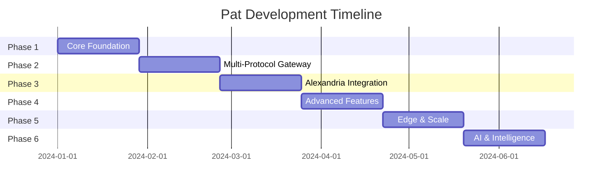

# Pat - Practical Development Roadmap

## Executive Summary

This roadmap translates the ultimate vision into a practical, achievable development plan that delivers value incrementally while building toward the complete platform.

**Key Principle**: Start simple, ship early, iterate based on feedback.

---

## Development Phases Overview



---

## Phase 1: MVP Foundation (Weeks 1-4)

### Goal: Working email testing with modern architecture

#### Week 1-2: Core Infrastructure
```
Priority: Get emails flowing end-to-end
```

**Deliverables:**
1. **Multi-Protocol Gateway (Basic)**
   ```go
   // Start with SMTP + HTTP API only
   type Gateway struct {
       smtp *SMTPServer  // Port 1025
       http *HTTPServer  // Port 8025
   }
   ```

2. **Event-Driven Core**
   ```go
   // Simple event bus using channels
   type EventBus struct {
       subscribers map[string][]chan Event
   }
   ```

3. **Storage Layer**
   ```go
   // PostgreSQL primary, in-memory for dev
   type Storage interface {
       Save(email *Email) error
       Get(id string) (*Email, error)
       List(filter Filter) ([]*Email, error)
   }
   ```

#### Week 3-4: Basic UI & API
```
Priority: Usable interface for developers
```

**Deliverables:**
1. **GraphQL API** (minimal schema)
   ```graphql
   type Query {
     emails(limit: Int, offset: Int): [Email!]!
     email(id: ID!): Email
   }
   
   type Mutation {
     deleteEmail(id: ID!): Boolean!
   }
   
   type Subscription {
     emailReceived: Email!
   }
   ```

2. **React UI** (essential features)
   - Email list with real-time updates
   - Email viewer with HTML preview
   - Simple search
   - Delete functionality

3. **CLI Tool**
   ```bash
   # Basic commands
   pat start        # Start local server
   pat list         # List emails
   pat clear        # Clear all emails
   pat tail         # Real-time email stream
   ```

**Success Criteria:**
- [ ] Can receive emails via SMTP
- [ ] Can view emails in web UI
- [ ] Real-time updates working
- [ ] Basic API functional

---

## Phase 2: Multi-Protocol Gateway (Weeks 5-8)

### Goal: Email ingestion from anywhere

#### Week 5-6: Protocol Expansion
```
Priority: Work in any environment
```

**Deliverables:**
1. **HTTP Ingestion API**
   ```typescript
   POST /api/ingest
   {
     "from": "test@example.com",
     "to": ["user@example.com"],
     "subject": "Test",
     "html": "<p>Test email</p>",
     "headers": {}
   }
   ```

2. **WebSocket Streaming**
   ```typescript
   // For real-time email injection
   ws.send(JSON.stringify({
     type: 'email',
     data: emailData
   }));
   ```

3. **SDK Development**
   ```javascript
   // Node.js SDK
   const pat = new Pat({ 
     endpoint: 'http://localhost:8025'
   });
   
   await pat.send({
     from: 'test@example.com',
     to: 'user@example.com',
     subject: 'Test',
     body: 'Test email'
   });
   ```

#### Week 7-8: Smart Client
```
Priority: Zero-config experience
```

**Deliverables:**
1. **Auto-Detection Client**
   ```typescript
   class PatClient {
     async connect() {
       // Try local SMTP first
       if (await this.checkLocal()) {
         return new SMTPTransport();
       }
       
       // Fall back to API
       if (process.env.PAT_API_KEY) {
         return new APITransport();
       }
       
       // Use proxy if available
       if (await this.checkProxy()) {
         return new ProxyTransport();
       }
     }
   }
   ```

2. **Framework Auto-Config**
   ```ruby
   # Gemfile
   gem 'pat-rails'
   
   # Automatically configures ActionMailer
   ```

**Success Criteria:**
- [ ] Works in local, Docker, CI/CD environments
- [ ] SDKs for Node.js, Python, Ruby, PHP
- [ ] Zero-config for major frameworks

---

## Phase 3: Alexandria Integration (Weeks 9-12)

### Goal: First-class Alexandria plugin

#### Week 9-10: Plugin Architecture
```
Priority: Seamless platform integration
```

**Deliverables:**
1. **Plugin Manifest**
   ```json
   {
     "id": "pat-email-testing",
     "name": "Pat - Email Testing",
     "permissions": [
       "network:listen:1025",
       "database:access",
       "event:publish"
     ]
   }
   ```

2. **Alexandria Hooks**
   ```typescript
   export class PatPlugin implements AlexandriaPlugin {
     async onActivate(context: PluginContext) {
       // Register UI routes
       context.ui.registerRoute('/emails', EmailDashboard);
       
       // Register API extensions
       context.api.extend(patGraphQLSchema);
       
       // Subscribe to events
       context.events.on('test:run', this.captureTestEmails);
     }
   }
   ```

#### Week 11-12: Platform Features
```
Priority: Leverage Alexandria capabilities
```

**Deliverables:**
1. **Unified Auth**
   ```typescript
   // Use Alexandria's auth
   const user = await context.auth.getCurrentUser();
   const emails = await pat.getEmails({ 
     tenant: user.tenantId 
   });
   ```

2. **Knowledge Base Integration**
   ```typescript
   // Link emails to docs
   await context.kb.link({
     email: emailId,
     article: 'email-best-practices'
   });
   ```

**Success Criteria:**
- [ ] Installs as Alexandria plugin
- [ ] Uses Alexandria auth/permissions
- [ ] Integrates with platform features

---

## Phase 4: Advanced Features (Weeks 13-16)

### Goal: CS-specific capabilities

#### Week 13-14: Validation Engine
```
Priority: Email quality assurance
```

**Deliverables:**
1. **Rule-Based Validation**
   ```typescript
   const rules = [
     { type: 'required_field', field: 'unsubscribe_link' },
     { type: 'max_length', field: 'subject', value: 100 },
     { type: 'regex', field: 'from', pattern: /@company\.com$/ }
   ];
   
   const results = await pat.validate(email, rules);
   ```

2. **Template Testing**
   ```typescript
   // Test email templates with data
   const result = await pat.testTemplate({
     template: 'welcome_email',
     data: { name: 'John', plan: 'premium' },
     rules: ['no_broken_links', 'personalization']
   });
   ```

#### Week 15-16: Workflow Engine
```
Priority: Multi-step email flows
```

**Deliverables:**
1. **Workflow Definition**
   ```yaml
   name: Customer Onboarding
   steps:
     - trigger: user_signup
       send: welcome_email
       wait: immediate
       
     - trigger: welcome_email_opened
       send: getting_started
       wait: 1d
       
     - trigger: no_activity_7d
       send: re_engagement
   ```

2. **Workflow Testing**
   ```typescript
   const execution = await pat.workflows.test('customer_onboarding', {
     user: { email: 'test@example.com', name: 'Test User' }
   });
   
   // Verify all emails sent correctly
   assert(execution.steps.all(s => s.status === 'completed'));
   ```

**Success Criteria:**
- [ ] Template validation working
- [ ] Basic workflows executable
- [ ] CS team can create rules

---

## Phase 5: Edge & Scale (Weeks 17-20)

### Goal: Production-ready performance

#### Week 17-18: Edge Deployment
```
Priority: Global accessibility
```

**Deliverables:**
1. **Edge Workers**
   ```javascript
   // Cloudflare Worker
   export default {
     async fetch(request) {
       const email = await parseEmailFromRequest(request);
       
       // Forward to nearest Pat region
       return await forwardToPatCore(email);
     }
   };
   ```

2. **CDN Integration**
   - Static assets on CDN
   - API responses cached where appropriate
   - WebSocket connection optimization

#### Week 19-20: Performance
```
Priority: Handle production load
```

**Deliverables:**
1. **Horizontal Scaling**
   ```yaml
   # Kubernetes deployment
   apiVersion: apps/v1
   kind: Deployment
   metadata:
     name: pat-gateway
   spec:
     replicas: 3
     template:
       spec:
         containers:
         - name: gateway
           resources:
             requests:
               memory: "256Mi"
               cpu: "500m"
   ```

2. **Performance Optimizations**
   - Connection pooling
   - Batch processing
   - Read replicas

**Success Criteria:**
- [ ] 10,000+ emails/second
- [ ] <100ms API response time
- [ ] 99.9% uptime

---

## Phase 6: AI & Intelligence (Weeks 21-24)

### Goal: Smart email testing

#### Week 21-22: AI Integration
```
Priority: Intelligent features
```

**Deliverables:**
1. **Email Analysis**
   ```typescript
   const analysis = await pat.ai.analyze(email);
   // {
   //   sentiment: 0.8,
   //   category: 'transactional',
   //   spamScore: 0.1,
   //   suggestions: ['Add unsubscribe link']
   // }
   ```

2. **Test Generation**
   ```typescript
   // Generate test emails from OpenAPI spec
   const tests = await pat.ai.generateTests({
     openapi: './api-spec.yml',
     operations: ['createOrder', 'resetPassword']
   });
   ```

#### Week 23-24: Launch Preparation
```
Priority: Production readiness
```

**Deliverables:**
1. **Migration Tools**
   ```bash
   # MailHog migration
   pat migrate mailhog --source http://localhost:8025
   ```

2. **Documentation**
   - Getting started guide
   - API reference
   - Migration guide
   - Video tutorials

**Success Criteria:**
- [ ] AI features functional
- [ ] Migration tools tested
- [ ] Documentation complete

---

## Minimum Viable Product (MVP) Definition

### Week 4 Checkpoint - "Pat v0.1"

**Must Have:**
- [x] SMTP server receiving emails
- [x] Web UI showing email list
- [x] Real-time updates via WebSocket
- [x] Basic API (GraphQL + REST)
- [x] PostgreSQL storage
- [x] Docker image

**Nice to Have:**
- [ ] Email search
- [ ] Multiple storage backends
- [ ] Authentication

**Not in MVP:**
- AI features
- Edge deployment
- Advanced workflows
- Multi-tenancy

### Quick Start Experience
```bash
# Docker
docker run -p 1025:1025 -p 8025:8025 pat/pat

# NPM
npx @pat/cli start

# Binary
curl -L https://get.pat.email | sh
pat start
```

---

## Risk Mitigation

### Technical Risks

| Risk | Mitigation |
|------|------------|
| Complex architecture | Start simple, add complexity gradually |
| Performance issues | Design for scale from day 1, optimize later |
| Protocol compatibility | Test with real-world applications early |

### Adoption Risks

| Risk | Mitigation |
|------|------------|
| MailHog users resistant | Maintain compatibility mode |
| Learning curve | Excellent documentation and examples |
| Feature parity | Focus on most-used features first |

---

## Resource Requirements

### Team Composition
- **Phase 1-2**: 2 developers (1 backend, 1 frontend)
- **Phase 3-4**: 3 developers + 1 DevOps
- **Phase 5-6**: 4 developers + 1 AI specialist

### Infrastructure
- **Development**: Local Docker
- **Staging**: Kubernetes cluster (small)
- **Production**: Multi-region Kubernetes + CDN

---

## Success Metrics by Phase

### Phase 1 (Week 4)
- Working MVP with basic features
- 10+ alpha testers using it

### Phase 2 (Week 8)
- Works in 3+ different environments
- SDKs for 4+ languages

### Phase 3 (Week 12)
- Fully integrated Alexandria plugin
- First customer service team using it

### Phase 4 (Week 16)
- 5+ CS teams actively using workflows
- 95% email validation accuracy

### Phase 5 (Week 20)
- Handling 100+ million emails/day
- 99.9% uptime achieved

### Phase 6 (Week 24)
- 1000+ active users
- 50+ migrated from MailHog
- 4.5+ star user rating

---

## Next Steps

1. **Week 1**: Set up development environment and CI/CD
2. **Week 1**: Begin SMTP server implementation
3. **Week 2**: Start basic UI development in parallel
4. **Week 4**: Release v0.1 for alpha testing
5. **Ongoing**: Gather feedback and iterate

This roadmap provides a practical path from concept to production-ready platform, with clear milestones and achievable goals at each phase.