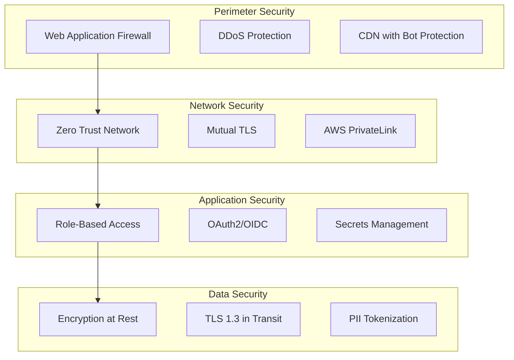

# Pat Security & Compliance Guide

## Overview

This guide details Pat's security architecture, compliance features, and implementation guidelines for enterprise deployments requiring regulatory compliance (GDPR, HIPAA, SOC2, ISO 27001).

---

## Security Architecture

### Defense in Depth



### Zero Trust Implementation

```yaml
Network Policies:
  default: deny-all
  
  ingress-rules:
    - name: allow-smtp
      from: edge-workers
      to: smtp-service
      ports: [25, 587, 465]
      
    - name: allow-api
      from: api-gateway
      to: backend-services
      ports: [443]
      
  service-mesh:
    provider: istio
    features:
      - automatic-mtls
      - service-identity
      - policy-enforcement
      - audit-logging
```

### Authentication & Authorization

```typescript
// Multi-factor authentication flow
class AuthenticationService {
  async authenticate(credentials: Credentials): Promise<AuthResult> {
    // 1. Verify credentials
    const user = await this.verifyCredentials(credentials);
    
    // 2. Check MFA requirement
    if (user.mfaEnabled) {
      const mfaToken = await this.requestMFA(user);
      if (!await this.verifyMFA(user, mfaToken)) {
        throw new MFAFailureError();
      }
    }
    
    // 3. Check device trust
    if (this.config.requireTrustedDevice) {
      await this.verifyDeviceTrust(credentials.deviceId);
    }
    
    // 4. Generate session
    return this.createSession(user, {
      ipAddress: credentials.ipAddress,
      userAgent: credentials.userAgent,
      deviceId: credentials.deviceId,
      expiresIn: this.config.sessionTimeout
    });
  }
}

// Fine-grained permissions
const permissions = {
  'email:read': ['view_emails', 'search_emails'],
  'email:write': ['delete_emails', 'modify_emails'],
  'email:admin': ['manage_retention', 'export_all'],
  'tenant:admin': ['manage_users', 'manage_settings'],
  'system:admin': ['manage_tenants', 'view_audit_logs']
};
```

---

## Data Protection

### Encryption Strategy

```yaml
At Rest:
  algorithm: AES-256-GCM
  key_management: AWS KMS / HashiCorp Vault
  key_rotation: 90 days
  
  databases:
    - PostgreSQL: Transparent Data Encryption
    - MongoDB: Encrypted Storage Engine
    - Elasticsearch: Encrypted Indices
    
  object_storage:
    - S3: SSE-KMS with CMK
    - Backup: Client-side encryption

In Transit:
  protocols:
    - External: TLS 1.3 only
    - Internal: mTLS with cert rotation
    
  cipher_suites:
    - TLS_AES_256_GCM_SHA384
    - TLS_CHACHA20_POLY1305_SHA256
    - TLS_AES_128_GCM_SHA256
```

### PII Handling

```typescript
class PIIProtection {
  private patterns = {
    ssn: /\b\d{3}-\d{2}-\d{4}\b/,
    creditCard: /\b\d{4}[\s-]?\d{4}[\s-]?\d{4}[\s-]?\d{4}\b/,
    email: /\b[A-Za-z0-9._%+-]+@[A-Za-z0-9.-]+\.[A-Z|a-z]{2,}\b/,
    phone: /\b\d{3}[-.]?\d{3}[-.]?\d{4}\b/,
    // ... more patterns
  };
  
  async maskEmail(email: Email, policy: MaskingPolicy): Promise<Email> {
    const masked = { ...email };
    
    // Mask body
    masked.body = await this.maskContent(email.body, policy);
    
    // Mask headers
    for (const [key, value] of Object.entries(email.headers)) {
      if (policy.shouldMaskHeader(key)) {
        masked.headers[key] = await this.maskContent(value, policy);
      }
    }
    
    // Mask attachments
    if (policy.maskAttachments) {
      masked.attachments = await this.maskAttachments(email.attachments);
    }
    
    // Audit log
    await this.auditLog.record({
      action: 'pii_masked',
      emailId: email.id,
      policy: policy.name,
      fieldsAffected: this.getAffectedFields(email, masked)
    });
    
    return masked;
  }
  
  private async maskContent(content: string, policy: MaskingPolicy): Promise<string> {
    let masked = content;
    
    for (const [type, pattern] of Object.entries(this.patterns)) {
      if (policy.includes(type)) {
        masked = masked.replace(pattern, (match) => {
          return policy.maskingMethod === 'hash' 
            ? this.hash(match)
            : '*'.repeat(match.length);
        });
      }
    }
    
    return masked;
  }
}
```

### Data Retention

```sql
-- Automated retention enforcement
CREATE OR REPLACE FUNCTION enforce_retention_policy()
RETURNS void AS $$
DECLARE
  tenant_record RECORD;
  deleted_count INTEGER;
BEGIN
  FOR tenant_record IN 
    SELECT id, retention_days, retention_policy
    FROM tenants
    WHERE retention_enabled = true
  LOOP
    -- Delete emails older than retention period
    DELETE FROM emails
    WHERE tenant_id = tenant_record.id
      AND received_at < NOW() - INTERVAL '1 day' * tenant_record.retention_days
      AND NOT EXISTS (
        SELECT 1 FROM legal_holds
        WHERE email_id = emails.id
          AND status = 'active'
      );
    
    GET DIAGNOSTICS deleted_count = ROW_COUNT;
    
    -- Audit log
    INSERT INTO retention_audit_log (
      tenant_id,
      action,
      deleted_count,
      retention_days,
      executed_at
    ) VALUES (
      tenant_record.id,
      'scheduled_deletion',
      deleted_count,
      tenant_record.retention_days,
      NOW()
    );
    
    -- Cascade delete related data
    PERFORM cleanup_orphaned_data(tenant_record.id);
  END LOOP;
END;
$$ LANGUAGE plpgsql;

-- Schedule daily execution
SELECT cron.schedule('enforce-retention', '0 2 * * *', 'SELECT enforce_retention_policy();');
```

---

## Compliance Features

### GDPR Compliance

```typescript
class GDPRCompliance {
  // Right to Access
  async exportUserData(userId: string): Promise<UserDataExport> {
    const data = {
      profile: await this.getProfile(userId),
      emails: await this.getAllEmails(userId),
      attachments: await this.getAllAttachments(userId),
      auditLogs: await this.getAuditLogs(userId),
      consents: await this.getConsents(userId)
    };
    
    return {
      data: await this.encryptExport(data),
      format: 'encrypted-json',
      generated: new Date(),
      expires: new Date(Date.now() + 48 * 60 * 60 * 1000) // 48 hours
    };
  }
  
  // Right to Erasure
  async deleteUserData(userId: string, verification: EraseRequest): Promise<void> {
    // Verify request authenticity
    await this.verifyEraseRequest(verification);
    
    // Check for legal holds
    const holds = await this.checkLegalHolds(userId);
    if (holds.length > 0) {
      throw new LegalHoldException(holds);
    }
    
    // Perform deletion
    await this.transaction(async (tx) => {
      await tx.emails.deleteByUser(userId);
      await tx.attachments.deleteByUser(userId);
      await tx.profiles.anonymize(userId);
      await tx.auditLogs.markAsDeleted(userId);
    });
    
    // Certificate of deletion
    await this.generateDeletionCertificate(userId);
  }
  
  // Consent Management
  async updateConsent(userId: string, consent: ConsentUpdate): Promise<void> {
    await this.consents.update({
      userId,
      type: consent.type,
      granted: consent.granted,
      timestamp: new Date(),
      ipAddress: consent.ipAddress,
      version: this.currentConsentVersion
    });
    
    // Apply consent changes
    if (!consent.granted) {
      await this.restrictProcessing(userId, consent.type);
    }
  }
}
```

### HIPAA Compliance

```typescript
class HIPAACompliance {
  // Access Controls
  async enforceMinimumNecessary(user: User, resource: Resource): Promise<boolean> {
    const role = await this.getUserRole(user);
    const permissions = await this.getRolePermissions(role);
    
    // Check if access is necessary for job function
    return this.isAccessNecessary(permissions, resource);
  }
  
  // Audit Logging
  async logAccess(access: AccessEvent): Promise<void> {
    await this.auditLog.write({
      userId: access.userId,
      patientId: access.patientId,
      resource: access.resource,
      action: access.action,
      timestamp: access.timestamp,
      workstation: access.workstation,
      reason: access.reason,
      // HIPAA required fields
      uniqueUserIdentifier: access.userId,
      patientIdentifier: access.patientId,
      eventType: this.mapToHIPAAEventType(access.action),
      eventOutcome: access.success ? 'Success' : 'Failure'
    });
  }
  
  // Encryption Standards
  validateEncryption(): EncryptionValidation {
    return {
      atRest: {
        algorithm: 'AES-256',
        keyLength: 256,
        mode: 'GCM',
        compliant: true
      },
      inTransit: {
        protocol: 'TLS',
        version: '1.3',
        cipherSuites: this.allowedCipherSuites,
        compliant: true
      }
    };
  }
}
```

### SOC2 Controls

```yaml
# Control mappings
CC6.1 - Logical Access Controls:
  implementation:
    - Multi-factor authentication
    - Role-based access control
    - Session management
    - Password policies
  
  evidence:
    - Access control matrix
    - Authentication logs
    - Permission audit reports

CC6.7 - Data Transmission:
  implementation:
    - TLS 1.3 enforcement
    - Certificate validation
    - Encrypted tunnels
  
  evidence:
    - SSL/TLS scan reports
    - Certificate inventory
    - Network flow logs

CC7.2 - System Monitoring:
  implementation:
    - Real-time alerting
    - Anomaly detection
    - Security scanning
  
  evidence:
    - Alert history
    - Scan reports
    - Incident responses
```

---

## Security Operations

### Incident Response

```typescript
class IncidentResponse {
  async handleSecurityIncident(incident: SecurityIncident): Promise<void> {
    // 1. Detect and Analyze
    const severity = await this.assessSeverity(incident);
    const impact = await this.assessImpact(incident);
    
    // 2. Contain
    if (severity >= Severity.HIGH) {
      await this.containThreat(incident);
      await this.notifySecurityTeam(incident);
    }
    
    // 3. Investigate
    const investigation = await this.investigate(incident);
    
    // 4. Remediate
    await this.remediate(investigation.findings);
    
    // 5. Report
    await this.generateIncidentReport({
      incident,
      severity,
      impact,
      investigation,
      remediation: investigation.remediation,
      lessonsLearned: investigation.lessonsLearned
    });
    
    // 6. Compliance Reporting
    if (this.requiresDisclosure(incident)) {
      await this.notifyAuthorities(incident);
      await this.notifyAffectedUsers(incident);
    }
  }
}
```

### Vulnerability Management

```yaml
Scanning Schedule:
  infrastructure:
    frequency: daily
    tools: [Qualys, Nessus]
    
  applications:
    frequency: per-deployment
    tools: [OWASP ZAP, Burp Suite]
    
  dependencies:
    frequency: continuous
    tools: [Snyk, Dependabot]
    
  containers:
    frequency: per-build
    tools: [Trivy, Clair]

Remediation SLAs:
  critical: 24 hours
  high: 7 days
  medium: 30 days
  low: 90 days
```

### Security Monitoring

```typescript
// Real-time threat detection
class ThreatDetection {
  rules = [
    {
      name: 'brute_force_attack',
      condition: 'failed_logins > 5 AND time_window < 5m',
      action: 'block_ip'
    },
    {
      name: 'data_exfiltration',
      condition: 'download_volume > 1GB AND time_window < 1h',
      action: 'alert_security'
    },
    {
      name: 'privilege_escalation',
      condition: 'role_change TO admin AND unusual_time',
      action: 'require_mfa'
    }
  ];
  
  async detectThreats(events: SecurityEvent[]): Promise<Threat[]> {
    const threats = [];
    
    for (const rule of this.rules) {
      const matches = await this.evaluateRule(rule, events);
      if (matches.length > 0) {
        const threat = {
          rule: rule.name,
          severity: this.calculateSeverity(rule, matches),
          events: matches,
          recommendedAction: rule.action
        };
        
        threats.push(threat);
        await this.executeAction(threat);
      }
    }
    
    return threats;
  }
}
```

---

## Compliance Reporting

### Automated Reports

```typescript
class ComplianceReporter {
  async generateComplianceReport(type: ComplianceType): Promise<Report> {
    switch (type) {
      case 'GDPR':
        return this.generateGDPRReport();
      case 'HIPAA':
        return this.generateHIPAAReport();
      case 'SOC2':
        return this.generateSOC2Report();
      case 'ISO27001':
        return this.generateISOReport();
      default:
        throw new Error(`Unsupported compliance type: ${type}`);
    }
  }
  
  private async generateGDPRReport(): Promise<Report> {
    return {
      title: 'GDPR Compliance Report',
      period: this.reportingPeriod,
      sections: [
        await this.dataInventory(),
        await this.processingActivities(),
        await this.consentManagement(),
        await this.dataBreaches(),
        await this.subjectRequests(),
        await this.crossBorderTransfers()
      ],
      attestation: await this.generateAttestation('GDPR'),
      generated: new Date()
    };
  }
}
```

### Audit Trail Requirements

```sql
-- Comprehensive audit schema for compliance
CREATE TABLE compliance_audit_log (
    -- Identity
    id UUID PRIMARY KEY DEFAULT gen_random_uuid(),
    event_id UUID UNIQUE NOT NULL,
    
    -- When
    occurred_at TIMESTAMPTZ NOT NULL,
    recorded_at TIMESTAMPTZ NOT NULL DEFAULT NOW(),
    
    -- Who
    user_id UUID,
    service_account_id UUID,
    ip_address INET,
    user_agent TEXT,
    session_id UUID,
    
    -- What
    action VARCHAR(100) NOT NULL,
    resource_type VARCHAR(50) NOT NULL,
    resource_id UUID,
    
    -- Changes
    old_values JSONB,
    new_values JSONB,
    
    -- Context
    request_id UUID,
    correlation_id UUID,
    tenant_id UUID NOT NULL,
    
    -- Compliance
    compliance_tags TEXT[],
    requires_review BOOLEAN DEFAULT FALSE,
    reviewed_by UUID,
    reviewed_at TIMESTAMPTZ,
    
    -- Integrity
    checksum VARCHAR(64) NOT NULL,
    
    -- Indexes for compliance queries
    INDEX idx_audit_user_time (user_id, occurred_at DESC),
    INDEX idx_audit_resource (resource_type, resource_id, occurred_at DESC),
    INDEX idx_audit_compliance (compliance_tags, occurred_at DESC),
    INDEX idx_audit_review (requires_review, reviewed_at) WHERE requires_review = TRUE
);

-- Immutability trigger
CREATE TRIGGER ensure_audit_immutability
BEFORE UPDATE OR DELETE ON compliance_audit_log
FOR EACH ROW EXECUTE FUNCTION prevent_audit_modification();
```

---

## Implementation Checklist

### Pre-Production Security Review

- [ ] Penetration testing completed
- [ ] Vulnerability assessment passed
- [ ] Security architecture review
- [ ] Threat modeling documented
- [ ] Encryption validation
- [ ] Access control audit
- [ ] Logging completeness check
- [ ] Incident response plan tested
- [ ] Disaster recovery verified
- [ ] Compliance controls validated

### Ongoing Security Tasks

- [ ] Daily vulnerability scans
- [ ] Weekly security metrics review
- [ ] Monthly access reviews
- [ ] Quarterly security training
- [ ] Annual penetration testing
- [ ] Continuous compliance monitoring

---

## Conclusion

Pat's security and compliance architecture provides defense-in-depth protection while meeting the strictest regulatory requirements. The automated compliance features and comprehensive audit trails ensure organizations can confidently deploy Pat in regulated environments while maintaining full visibility and control over their email testing infrastructure.