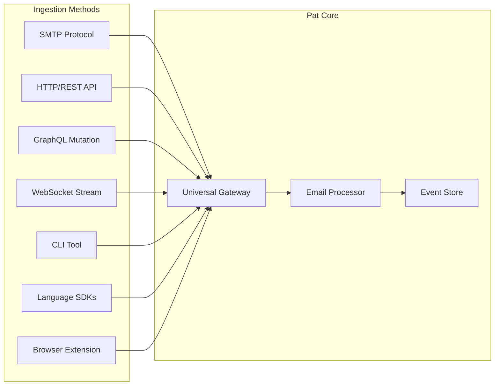
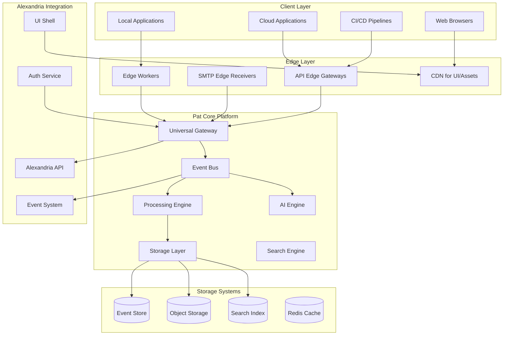

# Pat - Ultimate Email Testing Platform Solution Design

## Executive Summary

After deep analysis of email testing challenges in modern cloud environments, this document presents the ultimate solution design for Pat - a next-generation email testing platform that transcends traditional limitations through innovative architecture and seamless Alexandria integration.

**Core Innovation**: Pat reimagines email testing as a distributed, protocol-agnostic platform that works everywhere - from local development to global cloud deployments.

---

## Table of Contents

1. [Architecture Philosophy](#architecture-philosophy)
2. [Core Innovations](#core-innovations)
3. [System Architecture](#system-architecture)
4. [Implementation Strategy](#implementation-strategy)
5. [User Experience](#user-experience)
6. [Technical Deep Dive](#technical-deep-dive)
7. [Migration & Adoption](#migration--adoption)
8. [Future Vision](#future-vision)

---

## Architecture Philosophy

### Design Principles

1. **Protocol Agnostic**: Email ingestion should work via any transport
2. **Edge-First**: Process emails close to where they're generated
3. **Developer Ergonomics**: Zero-config local development, simple cloud deployment
4. **Real-Time Everything**: Instant feedback loops for testing
5. **Intelligence Built-In**: AI-powered validation and test generation

### Problem-Solution Mapping

| Problem | Traditional Approach | Pat's Solution |
|---------|---------------------|----------------|
| SMTP port blocking | VPN/Tunnels | Multi-protocol ingestion |
| Cloud connectivity | Complex networking | Edge workers + API gateway |
| Real-time updates | Polling | WebSocket + Server-Sent Events |
| Test data generation | Manual creation | AI-powered generators |
| Cross-environment testing | Different tools | Unified platform |

---

## Core Innovations

### 1. Universal Email Ingestion Engine



### 2. Edge-Powered SMTP Receivers

```yaml
Global Edge Network:
  Regions:
    - us-east-1: smtp-us-east.pat.email
    - eu-west-1: smtp-eu-west.pat.email
    - ap-south-1: smtp-ap-south.pat.email
  
  Features:
    - Anycast routing for lowest latency
    - Automatic failover
    - TLS termination at edge
    - DDoS protection
```

### 3. Intelligent Protocol Bridge

```typescript
// Automatically converts between protocols
class ProtocolBridge {
  async ingest(data: any, source: Protocol): Promise<Email> {
    const normalizer = this.getNormalizer(source);
    const email = await normalizer.normalize(data);
    
    // Enhance with AI
    email.metadata = await this.ai.analyze(email);
    email.suggestedTags = await this.ai.suggestTags(email);
    
    return email;
  }
}
```

### 4. Local-First Architecture

```typescript
// Works offline, syncs when online
class PatLocalEngine {
  private localDB: IndexedDB;
  private syncEngine: SyncEngine;
  
  async captureEmail(email: Email): Promise<void> {
    // Store locally first
    await this.localDB.emails.add(email);
    
    // Sync to cloud when available
    if (this.isOnline()) {
      await this.syncEngine.sync(email);
    } else {
      this.syncEngine.queueForSync(email);
    }
  }
}
```

---

## System Architecture

### High-Level Architecture



### Component Details

#### 1. Universal Gateway
```go
type UniversalGateway struct {
    protocols  map[Protocol]Ingester
    router     *Router
    authorizer *Authorizer
    rateLimit  *RateLimiter
    metrics    *Metrics
}

func (g *UniversalGateway) Ingest(ctx context.Context, data []byte, protocol Protocol) (*Email, error) {
    // Authenticate and authorize
    tenant, err := g.authorizer.Authenticate(ctx)
    if err != nil {
        return nil, err
    }
    
    // Rate limiting
    if err := g.rateLimit.Check(tenant); err != nil {
        return nil, err
    }
    
    // Protocol-specific ingestion
    ingester := g.protocols[protocol]
    email, err := ingester.Parse(data)
    if err != nil {
        return nil, err
    }
    
    // Enrich and process
    email.TenantID = tenant.ID
    email.ReceivedAt = time.Now()
    email.ID = uuid.New()
    
    // Async processing
    g.eventBus.Publish(EmailReceived{Email: email})
    
    return email, nil
}
```

#### 2. Edge Workers
```javascript
// Cloudflare Worker example
addEventListener('fetch', event => {
  event.respondWith(handleSMTPoverHTTP(event.request));
});

async function handleSMTPoverHTTP(request) {
  const smtpData = await request.arrayBuffer();
  
  // Forward to nearest Pat region
  const region = await findNearestRegion(request.cf);
  const response = await fetch(`https://${region}.pat.email/ingest`, {
    method: 'POST',
    headers: {
      'Content-Type': 'application/octet-stream',
      'X-Protocol': 'smtp-over-http',
      'Authorization': request.headers.get('Authorization')
    },
    body: smtpData
  });
  
  return response;
}
```

#### 3. AI-Powered Features
```python
class PatAI:
    def __init__(self, model_path: str):
        self.model = self.load_model(model_path)
        
    async def analyze_email(self, email: Email) -> EmailAnalysis:
        return EmailAnalysis(
            sentiment=await self.analyze_sentiment(email.body),
            category=await self.categorize(email),
            intent=await self.detect_intent(email),
            spam_score=await self.calculate_spam_score(email),
            suggested_responses=await self.generate_responses(email)
        )
    
    async def generate_test_email(self, template: str, context: dict) -> Email:
        prompt = f"Generate a test email based on template: {template} with context: {context}"
        return await self.model.generate(prompt)
    
    async def validate_workflow(self, workflow: Workflow, emails: List[Email]) -> ValidationResult:
        # Use AI to validate if email sequence follows expected workflow
        return await self.model.validate_sequence(workflow, emails)
```

---

## Implementation Strategy

### Phase 1: Foundation (Weeks 1-4)

#### Multi-Protocol Gateway
```yaml
Protocols Supported:
  - SMTP: Traditional email protocol
  - HTTP: REST API ingestion
  - GraphQL: Modern API
  - WebSocket: Real-time streaming
  - gRPC: High-performance RPC
  - AMQP: Message queue integration
  - Custom: Plugin architecture for new protocols
```

#### Local Development Experience
```bash
# Zero-config local development
npx pat dev

# Automatically:
# - Starts local SMTP server on 1025
# - Starts API server on 8025  
# - Opens UI on http://localhost:8080
# - Configures common frameworks (Rails, Django, Laravel, etc.)
```

### Phase 2: Edge Infrastructure (Weeks 5-8)

#### Global SMTP Edge Network
```typescript
// Automatic edge routing
const pat = new PatClient({
  apiKey: 'xxx',
  mode: 'auto' // Automatically selects best connection method
});

// In development: Uses local SMTP
// In CI/CD: Uses API
// In production: Uses nearest edge
await pat.send(email);
```

#### Edge Worker Deployment
```yaml
# pat-edge.yaml
deployments:
  - region: us-east-1
    workers: 10
    capabilities: [smtp, http, websocket]
    
  - region: eu-west-1
    workers: 5
    capabilities: [smtp, http]
    
  - region: ap-south-1
    workers: 5
    capabilities: [smtp, http]

routing:
  strategy: latency-based
  healthcheck: /health
  failover: automatic
```

### Phase 3: Intelligence Layer (Weeks 9-12)

#### AI-Powered Testing
```typescript
// Generate test scenarios automatically
const scenarios = await pat.ai.generateTestScenarios({
  application: 'e-commerce',
  userFlow: 'checkout',
  variations: 10
});

// Execute test scenarios
for (const scenario of scenarios) {
  const result = await pat.test.execute(scenario);
  console.log(`Scenario ${scenario.id}: ${result.status}`);
}
```

#### Smart Validation
```typescript
// AI-powered email validation
const validation = await pat.ai.validate(email, {
  checkFor: [
    'brand_consistency',
    'tone_appropriateness', 
    'regulatory_compliance',
    'accessibility_standards'
  ]
});

if (!validation.passed) {
  console.log('Issues found:', validation.issues);
}
```

### Phase 4: Alexandria Integration (Weeks 13-16)

#### Deep Platform Integration
```typescript
// Pat as first-class Alexandria citizen
export class PatAlexandriaPlugin implements AlexandriaPlugin {
  async onInstall(context: PluginContext) {
    // Register capabilities
    context.capabilities.register({
      id: 'email-testing',
      name: 'Pat Email Testing',
      triggers: ['email', 'test', 'smtp', 'mail'],
      aiContext: 'I provide email testing capabilities'
    });
    
    // Integrate with Alexandria AI
    context.ai.registerSkill({
      name: 'email-test-generation',
      handler: this.generateEmailTest.bind(this)
    });
    
    // Connect to knowledge base
    context.kb.registerDomain({
      domain: 'email-testing',
      ontology: this.emailTestingOntology
    });
  }
}
```

---

## User Experience

### Developer Workflow

#### 1. Local Development
```bash
# Install Pat CLI
npm install -g @pat/cli

# Initialize in project
pat init

# This creates .pat/config.yml:
# project: my-app
# environments:
#   local:
#     smtp_port: 1025
#     api_port: 8025
#   staging:
#     endpoint: https://staging.pat.email
#   production:
#     endpoint: https://prod.pat.email
```

#### 2. Framework Auto-Configuration
```ruby
# Rails automatically configured
# config/environments/development.rb
config.action_mailer.delivery_method = :smtp
config.action_mailer.smtp_settings = Pat.rails_config

# Pat detects Rails and configures automatically
```

#### 3. CI/CD Integration
```yaml
# .github/workflows/test.yml
- name: Email Tests
  uses: pat-email/action@v1
  with:
    api-key: ${{ secrets.PAT_API_KEY }}
    test-suite: ./tests/emails/**/*.test.js
```

### Customer Service Workflow

#### Visual Workflow Designer
```typescript
// Drag-and-drop workflow creation
const workflow = {
  name: "Customer Complaint Flow",
  steps: [
    {
      id: "receive_complaint",
      type: "email_received",
      conditions: {
        subject_contains: ["complaint", "issue", "problem"]
      }
    },
    {
      id: "auto_acknowledge", 
      type: "send_email",
      template: "complaint_acknowledgment",
      delay: "immediately"
    },
    {
      id: "escalate_if_severe",
      type: "conditional",
      condition: "sentiment < -0.7",
      true_branch: "escalate_to_manager",
      false_branch: "assign_to_agent"
    }
  ]
};

// Deploy and monitor
await pat.workflows.deploy(workflow);
```

---

## Technical Deep Dive

### Event-Sourced Architecture

```go
// Every state change is an event
type EmailEvent interface {
    GetEmailID() EmailID
    GetTimestamp() time.Time
    GetType() string
}

type EmailReceived struct {
    EmailID   EmailID
    From      string
    To        []string
    Subject   string
    Body      string
    Timestamp time.Time
}

type EmailValidated struct {
    EmailID   EmailID
    Results   []ValidationResult
    Timestamp time.Time
}

// Rebuild state from events
func RebuildEmailState(events []EmailEvent) *Email {
    email := &Email{}
    for _, event := range events {
        email.Apply(event)
    }
    return email
}
```

### CQRS Implementation

```go
// Commands (Write Side)
type EmailCommandHandler struct {
    eventStore EventStore
    publisher  EventPublisher
}

func (h *EmailCommandHandler) Handle(cmd Command) error {
    switch c := cmd.(type) {
    case *ReceiveEmailCommand:
        event := EmailReceived{
            EmailID: c.EmailID,
            From:    c.From,
            // ...
        }
        h.eventStore.Save(event)
        h.publisher.Publish(event)
    }
    return nil
}

// Queries (Read Side)
type EmailQueryHandler struct {
    readDB ReadDatabase
}

func (h *EmailQueryHandler) GetEmails(filter Filter) ([]*EmailDTO, error) {
    return h.readDB.Query(filter)
}
```

### Performance Optimizations

```go
// Batched processing for high throughput
type BatchProcessor struct {
    batch    []*Email
    batchSize int
    interval  time.Duration
}

func (p *BatchProcessor) Process() {
    ticker := time.NewTicker(p.interval)
    for {
        select {
        case email := <-p.incoming:
            p.batch = append(p.batch, email)
            if len(p.batch) >= p.batchSize {
                p.flush()
            }
        case <-ticker.C:
            if len(p.batch) > 0 {
                p.flush()
            }
        }
    }
}

// Zero-copy networking
func (s *SMTPServer) handleConnection(conn net.Conn) {
    // Use splice/sendfile for attachments
    if file, ok := conn.(*net.TCPConn); ok {
        file.ReadFrom(attachmentReader)
    }
}
```

---

## Migration & Adoption

### MailHog Migration

#### Automated Migration Tool
```bash
# Analyze existing MailHog setup
pat migrate analyze --source mailhog

# Output:
# Found MailHog instance at localhost:8025
# - 15,234 emails in storage
# - Configuration: in-memory storage
# - API version: v2
# 
# Migration plan:
# 1. Export emails via API
# 2. Transform to Pat format
# 3. Import to Pat instance
# 4. Update application config
# 5. Verify functionality

# Execute migration
pat migrate execute --source mailhog --target pat --verify
```

#### Compatibility Layer
```go
// MailHog API compatibility
func (p *Pat) MailHogCompatibility() http.Handler {
    router := mux.NewRouter()
    
    // Map MailHog endpoints to Pat
    router.HandleFunc("/api/v2/messages", p.handleMailHogMessages)
    router.HandleFunc("/api/v2/messages/{id}", p.handleMailHogMessage)
    
    return router
}
```

### Progressive Enhancement

```typescript
// Start with basic email capture
const pat = new Pat({ mode: 'basic' });

// Gradually adopt advanced features
pat.enableAI();
pat.enableWorkflows();
pat.enableAnalytics();

// Full platform capabilities
pat.setMode('advanced');
```

---

## Future Vision

### 1. Email Testing as Code
```yaml
# .pat/tests/checkout-flow.yml
name: Checkout Email Flow
scenarios:
  - name: Successful Purchase
    given:
      user: test@example.com
      cart: [product-1, product-2]
    when:
      action: complete_checkout
    then:
      expect_emails:
        - template: order_confirmation
          to: test@example.com
          within: 1m
        - template: shipping_notification
          to: test@example.com  
          within: 24h
```

### 2. Federated Email Testing
```typescript
// Connect multiple Pat instances
const federation = new PatFederation({
  instances: [
    { id: 'us-prod', url: 'https://us.pat.email' },
    { id: 'eu-prod', url: 'https://eu.pat.email' },
    { id: 'staging', url: 'https://staging.pat.email' }
  ]
});

// Query across all instances
const emails = await federation.query({
  from: 'noreply@company.com',
  timeRange: 'last-7-days'
});
```

### 3. Predictive Testing
```typescript
// AI predicts potential email issues
const predictions = await pat.ai.predict({
  changes: gitDiff,
  impactedFlows: ['user-registration', 'password-reset']
});

console.log(`Risk Score: ${predictions.riskScore}`);
console.log(`Suggested Tests: ${predictions.suggestedTests}`);
```

---

## Success Metrics

### Technical Excellence
- **Ingestion Rate**: 100,000+ emails/second globally
- **Query Performance**: <10ms p99 latency
- **Availability**: 99.99% uptime SLA
- **Storage Efficiency**: 10:1 compression ratio
- **AI Accuracy**: 95%+ validation accuracy

### Developer Experience
- **Time to First Email**: <30 seconds from install
- **Framework Support**: 50+ frameworks auto-configured
- **API Coverage**: 100% MailHog compatibility
- **Documentation**: Interactive examples for all features

### Business Impact
- **Adoption**: 1M+ developers within 2 years
- **Enterprise Customers**: 500+ in first year
- **Migration Success**: 95% successful MailHog migrations
- **User Satisfaction**: 4.8+ star rating

---

## Conclusion

Pat represents a paradigm shift in email testing - from a simple SMTP capture tool to an intelligent, distributed platform that adapts to modern development workflows. By solving the fundamental challenges of email testing in cloud environments while providing unprecedented developer experience and AI-powered capabilities, Pat doesn't just replace MailHog - it redefines what email testing can be.

The architecture's flexibility ensures Pat can evolve with changing technology landscapes while maintaining simplicity for developers who just need to test an email. This is not just an improvement over MailHog - it's the future of email testing.