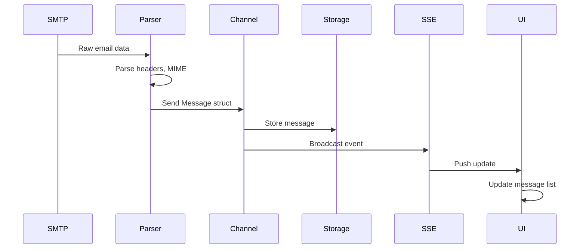
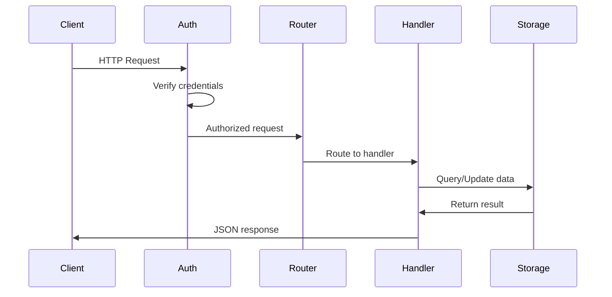

# Component Diagram - MailHog Detailed Components
**Generated**: 2025-06-11
**Architecture Level**: C4 Level 3

## Component Overview

```mermaid
graph TB
    subgraph "SMTP Server Container"
        Protocol[Protocol Handler<br/>smtp.Protocol]
        Session[Session Manager<br/>smtp.Session]
        MessageParser[Message Parser<br/>ParseMessage()]
        ChaosMonkey[Chaos Monkey<br/>Jim Interface]
    end
    
    subgraph "API Container"
        APIv1[API v1 Handler<br/>Frozen API]
        APIv2[API v2 Handler<br/>Active Development]
        MessageAPI[Message Endpoints<br/>CRUD Operations]
        EventAPI[Event Stream<br/>SSE Handler]
        ReleaseAPI[Release Handler<br/>SMTP Forward]
    end
    
    subgraph "Storage Container"
        StorageFactory[Storage Factory<br/>CreateStorage()]
        InMemImpl[In-Memory<br/>Implementation]
        MongoImpl[MongoDB<br/>Implementation]
        MaildirImpl[Maildir<br/>Implementation]
        MessageIndex[Message Index<br/>Search Support]
    end
    
    subgraph "Web UI Container"
        Router[UI Router<br/>web.CreateWeb()]
        Templates[Template Engine<br/>Go Templates]
        Assets[Static Assets<br/>Embedded FS]
        WSHandler[WebSocket Handler<br/>Real-time Updates]
    end
    
    subgraph "Common Components"
        Config[Configuration<br/>3-tier Config]
        Logger[Logger<br/>go-log]
        DataTypes[Data Types<br/>Message, MIME]
        HTTPAuth[HTTP Auth<br/>Basic Auth]
    end
    
    Protocol --> Session
    Session --> MessageParser
    Session --> ChaosMonkey
    MessageParser --> DataTypes
    
    APIv1 --> MessageAPI
    APIv2 --> MessageAPI
    MessageAPI --> StorageFactory
    EventAPI --> DataTypes
    ReleaseAPI --> Protocol
    
    StorageFactory --> InMemImpl
    StorageFactory --> MongoImpl
    StorageFactory --> MaildirImpl
    
    InMemImpl --> MessageIndex
    MongoImpl --> MessageIndex
    
    Router --> Templates
    Router --> Assets
    Router --> WSHandler
    WSHandler --> EventAPI
    
    APIv1 --> HTTPAuth
    APIv2 --> HTTPAuth
    Router --> HTTPAuth
```

## Component Details

### SMTP Server Components

#### Protocol Handler
- **Location**: `smtp/protocol.go`
- **Responsibility**: SMTP protocol state machine
- **Key States**:
  ```go
  INVALID, ESTABLISH, MAIL, RCPT, DATA
  ```
- **Commands**: HELO, EHLO, MAIL, RCPT, DATA, QUIT, RSET, NOOP

#### Session Manager
- **Location**: `smtp/session.go`
- **Responsibility**: Individual SMTP connection handling
- **Key Methods**:
  ```go
  Accept() // Handle new connection
  processCommand() // Route SMTP commands
  acceptMessage() // Store received message
  ```

#### Message Parser
- **Location**: `data/message.go`
- **Responsibility**: Parse raw email into structured data
- **Features**:
  - MIME parsing
  - Header extraction
  - Content-Type handling
  - Attachment detection

#### Chaos Monkey (Jim)
- **Location**: `jim/` package
- **Purpose**: Inject failures for testing
- **Failure Modes**:
  - Accept/reject connections
  - Disconnect during transfer
  - Reject recipients

### API Components

#### API v1 Handler
- **Status**: Frozen (no new features)
- **Endpoints**:
  ```
  GET    /api/v1/messages
  GET    /api/v1/messages/{id}
  DELETE /api/v1/messages/{id}
  DELETE /api/v1/messages
  GET    /api/v1/messages/{id}/download
  POST   /api/v1/messages/{id}/release
  GET    /api/v1/events
  ```

#### API v2 Handler
- **Status**: Active development
- **Improvements**:
  - Better search capabilities
  - Pagination support
  - Structured responses
  - OpenAPI specification

#### Message Endpoints
- **CRUD Operations**:
  ```go
  messages() // List with pagination
  message() // Get single message
  deleteOne() // Delete specific
  deleteAll() // Clear all messages
  ```

#### Event Stream Handler
- **Technology**: Server-Sent Events
- **Format**:
  ```json
  {
    "Id": "message-id",
    "From": {"Name": "", "Address": ""},
    "To": [{"Name": "", "Address": ""}],
    "Created": "timestamp"
  }
  ```

#### Release Handler
- **Purpose**: Forward emails to real SMTP
- **Configuration**: JSON file with SMTP servers
- **Features**:
  - Multiple SMTP server support
  - Custom recipient mapping
  - Authentication support

### Storage Components

#### Storage Factory
- **Pattern**: Abstract Factory
- **Selection Logic**:
  ```go
  switch config.Storage {
  case "memory": return CreateInMemory()
  case "mongodb": return CreateMongoDB()
  case "maildir": return CreateMaildir()
  }
  ```

#### In-Memory Implementation
- **Data Structure**: Slice with mutex
- **Indexing**: Message ID map
- **Limitations**: No persistence
- **Performance**: O(1) retrieval, O(n) search

#### MongoDB Implementation
- **Collections**:
  - `messages`: Full message data
  - `message_data`: Raw content
- **Indexes**: ID, Created timestamp
- **Features**: Full-text search

#### Maildir Implementation
- **Format**: Standard Maildir
- **Directories**: tmp/, new/, cur/
- **Naming**: Timestamp-based filenames
- **Compatibility**: Standard mail clients

### Web UI Components

#### UI Router
- **Framework**: Gorilla Pat
- **Routes**:
  ```
  /                 → Index page
  /css/*            → Stylesheets
  /js/*             → JavaScript
  /images/*         → Images
  /fonts/*          → Fonts
  ```

#### Template Engine
- **Technology**: Go html/template
- **Delimiters**: `[:` and `:]`
- **Variables**:
  - `Boundary`: WebSocket frame boundary
  - `Page`: Current page context
  - `APIHost`: API server URL

#### Static Assets
- **Storage**: Embedded via bindata
- **Assets**:
  - Bootstrap CSS/JS
  - jQuery
  - Custom app.js
  - Font files

#### WebSocket Handler
- **Purpose**: Alternative to SSE
- **Protocol**: JSON messages
- **Reconnection**: Automatic

### Common Components

#### Configuration System
- **Three Tiers**:
  1. Common config (shared)
  2. API-specific config
  3. UI-specific config
- **Sources**: CLI flags → Env vars → Defaults

#### Logger
- **Package**: ian-kent/go-log
- **Levels**: DEBUG, INFO, WARN, ERROR
- **Output**: stdout/stderr
- **Format**: Timestamp, level, message

#### Data Types
- **Core Types**:
  ```go
  type Message struct {
    ID      string
    From    Path
    To      []Path
    Content Content
    Created time.Time
    MIME    *MIMEBody
    Raw     Raw
  }
  ```

#### HTTP Authentication
- **Type**: HTTP Basic Auth
- **Storage**: File-based
- **Format**: `username:bcrypt_hash`
- **Middleware**: Applied to all HTTP routes

## Component Interactions

### Message Flow Sequence


### API Request Flow


## Design Patterns Used

1. **Abstract Factory**: Storage creation
2. **Strategy**: Storage implementations
3. **Observer**: SSE event broadcasting
4. **State Machine**: SMTP protocol handling
5. **Middleware**: Authentication chain
6. **Singleton**: Configuration instances
7. **Template Method**: Message parsing