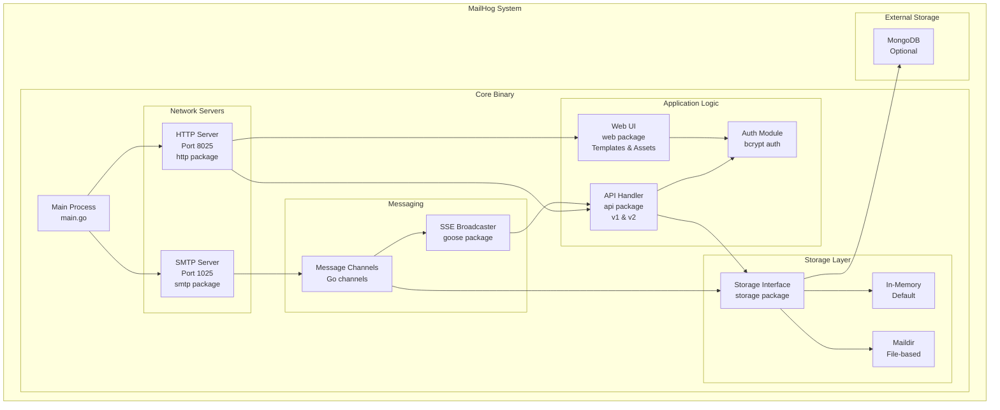

# Container Diagram - MailHog Internal Architecture
**Generated**: 2025-06-11
**Architecture Pattern**: Modular Monolith

## C4 Level 2: Container Diagram



## Container Descriptions

### 1. Main Process
- **Technology**: Go binary
- **Responsibility**: Application bootstrap and lifecycle management
- **Key Functions**:
  - Parse command-line arguments
  - Initialize configuration
  - Start SMTP and HTTP servers
  - Handle graceful shutdown

### 2. SMTP Server
- **Technology**: Custom Go SMTP implementation
- **Port**: 1025 (configurable)
- **Responsibility**: Accept and process incoming emails
- **Features**:
  - Full ESMTP protocol support
  - SMTP AUTH (PLAIN, CRAM-MD5)
  - PIPELINING support
  - Chaos Monkey for testing

### 3. HTTP Server
- **Technology**: Go net/http with Gorilla toolkit
- **Port**: 8025 (configurable)
- **Responsibility**: Serve API and web UI
- **Components**:
  - RESTful API endpoints
  - Static asset serving
  - WebSocket/SSE connections

### 4. API Handler
- **Technology**: Go with Gorilla Pat routing
- **Versions**: v1 (stable) and v2 (active)
- **Endpoints**:
  ```
  /api/v1/messages      - Message CRUD operations
  /api/v1/events        - Server-Sent Events
  /api/v2/messages      - Enhanced message operations
  /api/v2/search        - Advanced search
  ```

### 5. Web UI
- **Technology**: Go templates, vanilla JavaScript
- **Assets**: Embedded in binary
- **Features**:
  - Real-time message updates
  - Message preview (plain/HTML/source)
  - Search and filtering
  - Message download/release

### 6. Storage Interface
- **Pattern**: Strategy pattern for storage backends
- **Interface Methods**:
  ```go
  Store(message) (id, error)
  List(start, limit) (messages, error)
  Search(query) (messages, count, error)
  Delete(id) error
  Load(id) (message, error)
  ```

### 7. Storage Implementations

#### In-Memory Storage (Default)
- **Technology**: Go slices with mutex
- **Characteristics**:
  - Fast performance
  - No persistence
  - Limited by RAM
  - Suitable for development

#### MongoDB Storage
- **Technology**: mgo.v2 driver
- **Characteristics**:
  - Persistent storage
  - Scalable for large volumes
  - Requires external MongoDB
  - Searchable message history

#### Maildir Storage
- **Technology**: File system
- **Characteristics**:
  - Standard Maildir format
  - File-based persistence
  - No external dependencies
  - Compatible with mail clients

### 8. Message Flow Components

#### Message Channels
- **Technology**: Go channels
- **Purpose**: Async message distribution
- **Flow**:
  ```
  SMTP → messageChan → Storage
           ↓
         SSE Broadcaster
  ```

#### SSE Broadcaster
- **Technology**: Server-Sent Events (goose)
- **Purpose**: Real-time UI updates
- **Features**:
  - Automatic reconnection
  - Keep-alive messages
  - JSON message format

## Inter-Container Communication

### Synchronous Communications
1. **HTTP → API**: Direct function calls
2. **API → Storage**: Interface method calls
3. **API → Auth**: Middleware chain

### Asynchronous Communications
1. **SMTP → Storage**: Via message channels
2. **Storage → UI**: Via SSE events
3. **Main → Servers**: Via exit channels

## Security Boundaries

### Network Security
- SMTP: No encryption (development tool)
- HTTP: Optional Basic Auth
- Storage: Local access only (except MongoDB)

### Authentication Flow
```
HTTP Request → Auth Middleware → BCrypt Verify → Handler
```

## Deployment Configurations

### Single Binary (Default)
```
MailHog (single process)
├── SMTP Server (goroutine)
├── HTTP Server (goroutine)
└── In-Memory Storage
```

### With MongoDB
```
MailHog
├── SMTP Server
├── HTTP Server
└── MongoDB Client → External MongoDB
```

### Multi-Instance
```
Load Balancer
├── MailHog Instance 1 → Shared MongoDB
├── MailHog Instance 2 → Shared MongoDB
└── MailHog Instance 3 → Shared MongoDB
```