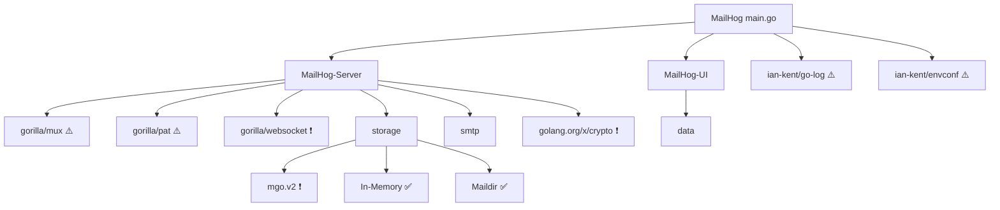

# Dependency Analysis & Risk Assessment
**Analysis Version**: v1-2025-06-11
**Last Vendor Update**: 2017-04-16 (7+ years ago)

## Dependency Risk Matrix
| Dependency | Version | Last Updated | Maintainer Activity | Risk Level | Usage Location |
|------------|---------|--------------|-------------------|------------|----------------|
| gorilla/websocket | 2017-03-19 | 2017-03-19 | Active (but old version) | ❗ Critical | WebSocket connections |
| gopkg.in/mgo.v2 | 2016-06-09 | 2018 (abandoned) | Abandoned | ❗ Critical | MongoDB storage backend |
| golang.org/x/crypto | 2016-12-21 | 2016-12-21 | Active (but old version) | ❗ Critical | BCrypt authentication |
| gorilla/mux | 2017-02-28 | 2017-02-28 | Active (but old version) | ⚠️ Medium | HTTP routing |
| mailhog/* packages | 2017-04-16 | 2017-04-16 | Own packages | ⚠️ Medium | Core functionality |
| ian-kent/go-log | 2016-01-13 | Unknown | Unknown | ⚠️ Medium | Logging framework |

## Security Vulnerabilities Identified
1. **CVE-2020-27813** - gorilla/websocket DoS vulnerability (CVSS 7.5)
   - Integer overflow allows denial of service
   - Affects versions <= 1.4.0
   - Current version from 2017 is vulnerable

2. **Outdated Crypto Library**
   - golang.org/x/crypto from 2016 missing 7+ years of security patches
   - Used for BCrypt password hashing in authentication

3. **Abandoned MongoDB Driver**
   - mgo.v2 officially deprecated since 2018
   - No security updates or bug fixes
   - Recommended replacement: official mongo-go-driver

## Dependency Graph


## Migration Recommendations

### Priority 1: Security-Critical Updates
1. **Replace gorilla/websocket**
   ```bash
   # Old: github.com/gorilla/websocket (2017 version)
   # New: github.com/gorilla/websocket v1.5.1
   go get -u github.com/gorilla/websocket@latest
   ```

2. **Update golang.org/x/crypto**
   ```bash
   # Old: golang.org/x/crypto (2016 version)  
   # New: golang.org/x/crypto v0.23.0
   go get -u golang.org/x/crypto@latest
   ```

3. **Replace mgo.v2 with official driver**
   ```go
   // Old: gopkg.in/mgo.v2
   // New: go.mongodb.org/mongo-driver
   import "go.mongodb.org/mongo-driver/mongo"
   ```

### Priority 2: Framework Updates
- Update all gorilla packages to latest versions
- Consider replacing ian-kent packages with maintained alternatives
- Migrate from govendor to Go modules

### Priority 3: Testing Dependencies
- Update smartystreets/goconvey for testing
- Remove unused dependencies

## Dependency Management Migration

### Current State (vendor.json + vendor/)
```json
{
    "comment": "",
    "ignore": "test",
    "package": [
        {
            "checksumSHA1": "g/V4qRXjl5lp[...]",
            "path": "github.com/gorilla/websocket",
            "revision": "a91eba7f97777409bc2c443f5534d41dd20c5720"
        }
    ]
}
```

### Target State (go.mod)
```go
module github.com/mailhog/MailHog

go 1.21

require (
    github.com/gorilla/mux v1.8.1
    github.com/gorilla/pat v1.0.2
    github.com/gorilla/websocket v1.5.1
    golang.org/x/crypto v0.23.0
    go.mongodb.org/mongo-driver v1.13.1
    // ... other dependencies
)
```

## Risk Mitigation Strategy

### Immediate Actions (Week 1)
1. Create go.mod file and migrate from vendor
2. Update security-critical dependencies
3. Run security scanning tools

### Short-term (Weeks 2-4)
1. Replace abandoned dependencies
2. Update all gorilla packages
3. Implement dependency scanning in CI

### Long-term
1. Regular dependency updates (monthly)
2. Automated security scanning
3. Consider dependency injection for storage backends

## Validation Tests
```bash
# Test WebSocket functionality after update
go test ./... -tags=websocket

# Verify BCrypt still works
go test ./... -run=TestAuth

# MongoDB integration tests (if using MongoDB)
go test ./... -tags=mongodb
```