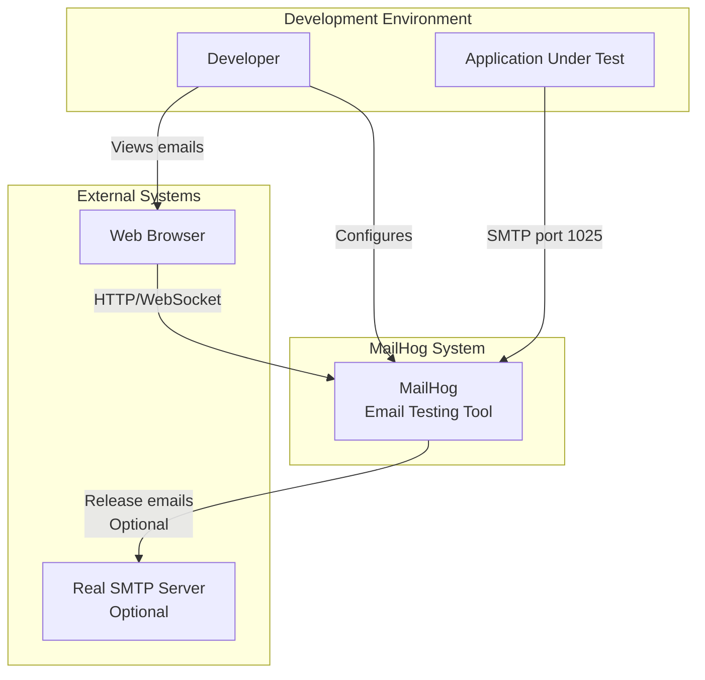

# System Context - MailHog Email Testing Tool
**Generated**: 2025-06-11
**Architecture Pattern**: Monolithic with Modular Components

## C4 Level 1: System Context



## System Purpose
MailHog is an email testing tool designed for developers to:
- Capture emails sent from applications during development/testing
- Prevent test emails from reaching real recipients
- Inspect email content, headers, and attachments
- Optionally release emails to real SMTP servers

## Key System Interactions

### 1. Application Integration
- **Protocol**: SMTP on port 1025
- **Purpose**: Applications send emails to MailHog instead of real mail servers
- **Configuration**: Simple SMTP host/port change in application

### 2. Developer Interface
- **Web UI**: http://localhost:8025
- **API**: RESTful API for programmatic access
- **Real-time**: Server-Sent Events for live updates

### 3. External SMTP (Optional)
- **Purpose**: Release specific emails to real recipients
- **Protocol**: Standard SMTP
- **Control**: Manual release through UI/API

## System Boundaries

### Inside System Boundary
- SMTP server implementation
- Message storage (memory/MongoDB/Maildir)
- HTTP API server
- Web UI application
- Authentication system
- Message search and filtering

### Outside System Boundary
- Applications sending emails
- Web browsers accessing UI
- External SMTP servers
- MongoDB database (when using MongoDB storage)

## Key Quality Attributes

### Performance
- Handles 1000+ messages in memory efficiently
- Sub-second message reception
- Real-time UI updates via SSE

### Reliability
- Optional persistent storage (MongoDB/Maildir)
- Graceful degradation with Chaos Monkey
- No message loss during normal operation

### Security
- Optional HTTP Basic Authentication
- BCrypt password hashing
- No external network access by default
- Isolated from production email flow

### Usability
- Zero configuration for basic usage
- Single binary deployment
- Cross-platform compatibility
- Intuitive web interface

## Deployment Context

### Development Environment
```
Developer Machine
├── Application (port varies)
├── MailHog (ports 1025, 8025)
└── Browser
```

### CI/CD Environment
```
CI Runner
├── Test Suite
├── MailHog Container
└── Test Verification Scripts
```

### Team Environment
```
Shared Server
├── MailHog Instance
├── Multiple Developer Apps → MailHog
└── Shared Web UI Access
```

## Configuration Overview

### Minimal Configuration
```bash
# Just run it
./MailHog
```

### Common Configuration
```bash
# With authentication and MongoDB
./MailHog \
  -auth-file=/path/to/auth \
  -storage=mongodb \
  -mongo-uri=mongodb://localhost/mailhog
```

### Environment Variables
- `MH_SMTP_BIND_ADDR`: SMTP server address
- `MH_API_BIND_ADDR`: API server address  
- `MH_UI_BIND_ADDR`: UI server address
- `MH_STORAGE`: Storage backend selection
- `MH_AUTH_FILE`: Authentication file path