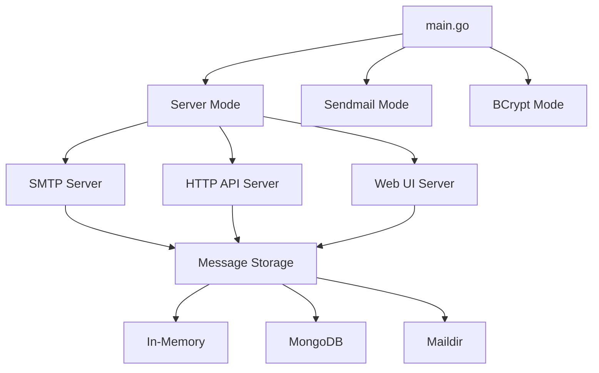

# Module Discovery Index
**Generated**: 2025-06-11T14:30:00Z
**Status**: 0/7 modules analyzed

## Module Priority Matrix
| Module | Business Critical | Complexity | Analysis Status |
|--------|------------------|------------|-----------------|
| `main.go` | ❗ High | Medium | ⏳ Pending |
| `config/` | ⚠️ Medium | Low | ⏳ Pending |
| `MailHog-Server/` | ❗ High | High | ⏳ Pending |
| `MailHog-UI/` | ❗ High | Medium | ⏳ Pending |
| `data/` | ❗ High | Low | ⏳ Pending |
| `storage/` | ❗ High | Medium | ⏳ Pending |
| `smtp/` | ❗ High | High | ⏳ Pending |

## Entry Points Discovered
- `main.go:15` - Application bootstrap and mode selection
- `main.go:39` - Server mode initialization
- `main.go:65` - Sendmail mode entry point
- `main.go:79` - BCrypt utility mode

## Core Functionality Map

## External Dependencies
- HTTP Routing: `gorilla/pat`, `gorilla/mux`
- WebSocket: `gorilla/websocket`
- MongoDB: `gopkg.in/mgo.v2`
- Logging: `ian-kent/go-log`
- Configuration: `ian-kent/envconf`
- EventSource: `ian-kent/goose`
- Crypto: `golang.org/x/crypto/bcrypt`

## Next Analysis Priority
1. **MailHog-Server**: Core SMTP and API implementation
2. **storage**: Data persistence layer
3. **MailHog-UI**: Web interface
4. **smtp**: Protocol implementation
5. **data**: Message structures
6. **config**: Configuration management